<!--
Durata target: 18-20 minuti.
Formato: 16 slide, circa 60-75 secondi per slide.
Pubblico: tecnico, ma non necessariamente esperto di AI o agentic coding.
Obiettivo narrativo: spiegare cosa abbiamo costruito, perché funziona, come viene usato dai modelli e quali possibilità apre.
-->

# Stack AI operativo per QA e agentic coding

## Un sistema governato di agenti, policy e handoff - Daniele Quero
<br><br><br>

**pagopa-platform-integration-test**

<!--
Speaker note (1:00): Aprire con il messaggio principale: non stiamo presentando un singolo prompt, ma uno stack operativo. Lo stack consente a un modello di lavorare dentro regole, ruoli e processi verificabili.
-->

---

# Obiettivo della presentazione

1. Capire quali risorse AI sono state introdotte nel repository
2. Chiarire come prompt, agenti e instruction cooperano
3. Comprendere front matter, Markdown e handoff
4. Sintetizzare il lavoro che ha portato al risultato
5. Mostrare potenzialità, limiti e prossimi passi

<!--
Speaker note (0:50): Impostare le aspettative: sarà una lettura tecnica, ma guidata. I dettagli servono per rendere il sistema comprensibile e mantenibile, non per fare teoria astratta sui modelli.
-->

---

# Perché serve uno stack AI

Nel repository convivono test API, integrazione ed end-to-end.

I flussi QA richiedono:

- analisi di requisiti e scenari Gherkin
- implementazione di step Python
- esecuzione Behave e diagnosi dei failure
- reportistica Allure
- commit e pull request coerenti con policy di progetto


## Senza governance, un agente AI tende a essere utile ma **imprevedibile**.

```markdown
Utente
  |
1. .github/prompts       comandi riusabili: /qa, /commit, /pr, /promptize
  |
2. .github/agents        ruoli operativi: Analyst, Engineer, Runner, Closer
  |
3. .github/instructions  policy applicate per tipo file o workflow

```

<!--
Speaker note (1:05): Collegare al contesto reale del repo: Behave, Gherkin, Python, Allure, workflow GitHub Actions. Il problema non è solo generare codice: è coordinare responsabilità, scope, test, report e chiusura.
-->

---


# Livello 1: prompt riusabili

I file `.prompt.md` trasformano richieste ricorrenti in comandi stabili.

Esempi:

- `qa.prompt.md`: avvia il processo QA iterativo
- `commit.prompt.md`: crea commit conformi alle linee guida
- `pr.prompt.md`: crea PR con template e metadati corretti
- `promptize.prompt.md`: trasforma una richiesta libera in istruzioni operative

<br>

## Il **valore**: l'utente non deve ricordare ogni dettaglio procedurale.

<!--
Speaker note (1:00): Spiegare che un prompt file è come un comando di alto livello. Non sostituisce il processo: lo incapsula e lo rende ripetibile.
-->

---

# Com'è fatto un prompt file

## `/qa`
```markdown
<!-- Front matter (yml) -->
---
description: 'Iterative quality assurance process using the QA Loop'
agent: "QA-orchestrator"
argument-hint: "Task ID, suite name, and objective"
---

<!-- Prompt (md)-->
If no text prompt is provided with the `/qa` command,
use the chat context to determine the implicit request.

${input:Describe the QA task or process to execute}
```

Il prompt contiene:

- metadati per VS Code/Copilot (`front matter`)
- istruzioni testuali per il modello
- placeholder per input utente

<!--
Speaker note (1:15): Qui introdurre il concetto di file Markdown eseguibile dal punto di vista operativo: non è codice, ma diventa contesto strutturato che il modello riceve quando il prompt viene invocato.
-->

---

# Cos'è il front matter

Il front matter è un blocco YAML all'inizio del file Markdown.

## `from Python-utility-engineer.agent.md`
```yaml
---
description: "Use when: Python step definitions need to be implemented"
model: "GPT-5.3-Codex"
tools: [read/readFile, edit/createFile, edit/editFiles]
agents: [Python-utility-engineer]
user-invocable: true
---
```

Serve a dichiarare dati che non sono contenuto narrativo:

- quando usare un asset
- quale modello preferire
- quali tool sono consentiti
- quali agenti possono essere coinvolti

<!--
Speaker note (1:20): Rendere chiaro che il front matter è metadata, non slide/testo normale. I sistemi agentici lo leggono per configurare il comportamento: routing, modello, tool e invocabilità.
-->

---

# Livello 2: agenti come ruoli

Un **agente** è un sistema in cui un LLM non risponde solo una volta, ma **opera in un ciclo** fino a completare un obiettivo. L'agente può:
  - Pianificare
  - Usare tool
  - Osservare risultati
  - Adattare il piano
  - Ripetere fino al completamento


<div style="display:flex;gap:24px;align-items:flex-start;margin-top:0.4em;">
<div style="flex:1;background:#e3f2fd;border-left:4px solid #1565c0;border-radius:6px;padding:14px 16px;font-size:0.9em;">
<strong>Il modello non deve "fare tutto"</strong>: deve agire nello specifico ruolo corretto.<br><br>
Indicazioni generiche portano a:<br>
• <strong>modifiche fuori scope</strong><br>
• <strong>perdita di contesto</strong><br>
• <strong>scarsa precisione</strong>
</div>
<div style="flex:2;">
Ogni <code>.agent.md</code> definisce una responsabilità specifica. Esempi:
<table>
<thead><tr><th>Agente</th><th>Responsabilità principale</th></tr></thead>
<tbody>
<tr><td><code>QA-orchestrator</code></td><td>coordina il ciclo end-to-end</td></tr>
<tr><td><code>QA-analyst</code></td><td>produce o rivede feature Gherkin</td></tr>
<tr><td><code>QA-engineer</code></td><td>implementa step Python</td></tr>
<tr><td><code>QA-runner</code></td><td>esegue test e diagnostica failure</td></tr>
<tr><td><code>QA-closer</code></td><td>aggiorna docs, commit, push e PR</td></tr>
<tr><td><code>Python-utility-engineer</code></td><td>cura utility Python condivise o di suite</td></tr>
</tbody>
</table>
</div>
</div>

<!--
Speaker note (1:10): Evidenziare la separazione dei ruoli. Questo riduce side effect: il runner non modifica codice, l'analyst non scrive Python, il closer non cambia feature.
-->

---

# Anatomy di un agente

Un agente combina tre parti:

1. **Front matter**: metadati come modello, tool, handoff, invocabilità
2. **Workflow**: passi da seguire in ordine
3. **Constraints**: cosa non deve fare

<br>

Esempio dal `QA-runner`:

Handoff da QA-orchestrator
  ├─► scopre le istruzioni di run 
  ├─► mostra il comando e chiede conferma
  ├─► esegue i test
  └─►   in caso di failure avvia un fix loop massimo di **5 iterazioni**

    - delegando le modifiche al `QA-engineer`
    - verificando ad ogni iterazione se la fix ha risolto il problema
    - cedendo il testimone all'utente se il fix loop non risolve il problema (entro 5 iterazioni) 


<!--
Speaker note (1:05): Spiegare che gli agenti sono contratti operativi. Il modello riceve un perimetro: strumenti ammessi, responsabilità, stop condition e forma dell'output.
-->

---


# Handoff: passare lavoro tra agenti

Un handoff è un passaggio controllato da un agente a un altro.

## `from QA-analyst.agent.md`
```yaml
handoffs:
  - label: Implement step definitions
    agent: QA-engineer
    prompt: "Implement the Python step definitions..."
    send: false
```

Nel repository esistono due modalità:

- **invisibile**: orchestratore delega a sub-agent senza click utente
    ```text
    esplicitamente indicato nel suo workflow o, più raramente, desunto dall'analisi del contesto.
    ```
- **visibile**: agente standalone propone un passaggio (vedi `send: false/true`)
    ```text
    definendo la property handoff.
    ```

L'**handoff** conserva contesto e responsabilità, evitando passaggi informali.

<!--
Speaker note (1:20): Spiegare bene send: false: l'agente prepara un'azione suggerita, ma non la invia automaticamente. Nel percorso orchestrato invece la delega può essere interna e non richiede click.
-->

---
# Livello 3: instruction come policy

Gli `.instructions.md` sono regole applicate per scope.
Nel front matter si dichiara `applyTo: <pattern>` per indicare a quali file o workflow si applicano, ma non è obbligatorio.

Esempi:

- `python-scripts.instructions.md` si applica a `**/*.py`  - **istruzioni generali per script Python**
- `behave-steps.instructions.md` si applica a `src/**/steps/**/*.py` - **istruzioni per step Python di Behave**
- `gherkin.instructions.md` si applica a `src/**/*.feature` - **linee guida per file Gherkin**
- `run-tests.instructions.md` viene caricato esplicitamente dal runner - **istruzioni per eseguire i test e diagnosticare failure**
- `git-commit.instructions.md` e `git-pr.instructions.md` governano chiusura e PR - **istruzioni per commit e PR coerenti con le policy di progetto**

<br>

## Le regole diventano una memoria operativa condivisa. 
Applicate automaticamente in caso di presenza di `applyTo`, oppure **caricate esplicitamente** da un agente (ad esempio il `QA-orchestrator`, nella sua struttura).

Più pulito rispetto a istruzioni di sistema (`AGENTS.md` e `INSTRUCTIONS.md`)

<!--
Speaker note (1:15): Chiarire applyTo: è una regola di scope. Quando un agente lavora su un file che matcha quel pattern, deve caricare quelle istruzioni e seguirle.
-->


---

# Ciclo QA agentico

```text
Input utente
  |
QA-orchestrator
  ├─► QA-analyst (subagent)  -> feature Gherkin e spiegazione scenari
  ├─► QA-engineer (subagent) -> step definitions Python
  ├─► QA-runner (subagent)   -> esecuzione, diagnosi, fix loop
  └─► QA-closer (subagent)   -> README, failure report, commit, PR 
```

Il ciclo esplicita chi decide, chi implementa, chi verifica e chi chiude.

## Esempio realistico: nuova suite QA

1. L'utente invia task ID, suite e obiettivo tramite `/qa`
2. `QA-orchestrator` verifica branch e condivide un piano
3. `QA-analyst` crea o valida le `.feature`
4. `QA-engineer` implementa gli step seguendo instruction Python e Behave
5. `QA-runner` esegue Behave con Allure/JUnit e analizza l'esito
6. Se <span style="font-weight:bold;font-style:italic;color:#00cc00">verde</span>, `QA-closer` aggiorna documentazione e apre PR se previsto

<!--
Speaker note (1:05): Legare al valore pratico: il flusso riproduce un team QA reale. L'orchestratore non fa tutto; coordina competenze specializzate.
-->

---

# Il lavoro che ha portato al risultato

Dal prompt... 
<br>
&nbsp;&nbsp;&nbsp;&nbsp;&nbsp;&nbsp;&nbsp;&nbsp;&nbsp;&nbsp;&nbsp;&nbsp;&nbsp;&nbsp;&nbsp;&nbsp;&nbsp;&nbsp;&nbsp;&nbsp;&nbsp;&nbsp;&nbsp;&nbsp;&nbsp;&nbsp;&nbsp;&nbsp;...**allo stack**.

È stato necessario:

- mappare le convenzioni esistenti
- separare responsabilità tra ruoli QA
- trasformare pratiche implicite in instruction versionate
- ricavare prompt riusabili per task frequenti
- documentare handoff e condizioni di stop
- allineare agenti, prompt, instruction, README e `AGENTS.md`

<br>

## In pratica: codificare il modo in cui il team lavora.

<!--
Speaker note (1:15): Far emergere la parte di engineering. La qualità dello stack dipende da analisi del processo, non da un prompt brillante scritto una volta.
-->

---

# Potenzialità e Criticità
<br><br>
<div style="display:flex;gap:24px;align-items:flex-start;margin-top:0.4em;">
<div style="flex:1;">
<div style="background:#e8f5e9;border-left:4px solid #2e7d32;border-radius:6px;padding:12px 16px;font-size:0.88em;">
<strong style="color:#2e7d32;">✦ Potenzialità</strong><br><br>
Lo stack abilita:<br>
• <strong>onboarding</strong> più rapido su convenzioni QA<br>
• automazione di attività <strong>ripetitive</strong>, <strong>noiose</strong>, <strong>prone a errori</strong><br>
• riduzione di <strong>errori</strong> su commit, PR, run test e report<br>
• <strong>separazione chiara</strong> tra analisi, implementazione, verifica e chiusura<br>
• <strong>miglioramento incrementale</strong>: ogni regola utile diventa instruction o agente<br>
• <strong>tracciabilità</strong>: gli asset AI sono versionati accanto al codice<br><br>
<em>Meno variabilità, meno conoscenza tribale, più ripetibilità.</em>
</div>
</div>
<div style="flex:1;">
<div style="background:#fce4ec;border-left:4px solid #c62828;border-radius:6px;padding:12px 16px;font-size:0.88em;">
<strong style="color:#c62828;">⚠ Criticità</strong><br><br>
Lo stack richiede <strong>manutenzione</strong>:<br>
• <strong>instruction duplicate</strong> o divergenti → conflitti<br>
• <strong>front matter errato</strong> → routing o modello rotto<br>
• <strong>handoff troppo generici</strong> → contesto insufficiente<br>
• <strong>agenti troppo permissivi</strong> → modifiche fuori scope<br>
• <strong>comandi e path</strong> devono restare allineati al repo<br><br><br><br>
<em>Governare l'AI significa mantenere aggiornato il suo contesto.</em>
</div>
</div>
</div>

<!--
Speaker note (1:05): Bilanciare potenziale e limiti. Il messaggio pratico: meno variabilità, meno conoscenza tribale, più ripetibilità. Ma il sistema richiede manutenzione: instruction obsolete, path errati o agenti troppo permissivi portano a decisioni sbagliate. Il contesto dell'AI va curato come il codice.
-->

---

# Prossimi passi consigliati
**Breve termine:**
1. Allineare periodicamente README, AGENTS e instruction operative
3. Misurare metriche semplici: tempi di completamento, failure ricorrenti, fix loop, costo in crediti
4. Esplicitare più possibile i casi in cui l'agente deve fermarsi e chiedere conferma

<br>

## Obiettivo: far crescere lo stack come prodotto interno, non come esperimento isolato.

**Medio termine:**
1. Aggiungere agenti per **altri ruoli**
2. **Introdurre AI** nelle logiche di test e diagnostica (es. analizzare report NRT)
3. Migrare stack su server **MCP**:
    - generalizzando il concetto di orchestratore e agenti a più repository
    - rendendo configurabili (anche con UI) le policy e le istruzioni operative

<!--
Speaker note (1:00): Chiudere con una prospettiva realistica. Il sistema è già utile, ma diventa più forte se misurato, curato e integrato nel modo di lavorare quotidiano.
-->

---

<!-- _class: extra-slide -->
<!-- _footer: "" -->
<!-- _paginate: false -->

# FLOWCHARTS

<!--
Speaker note (0:10): Slide separatoria per passare all'appendice tecnica dei flussi.
-->

---

<!-- _class: flow-slide -->

# Appendice Flussi: QA Orchestrator


---

<!-- _class: flow-slide -->

# Appendice Flussi: QA Analyst


---

<!-- _class: flow-slide -->

# Appendice Flussi: QA Engineer


---

<!-- _class: flow-slide -->

# Appendice Flussi: QA Runner


---

<!-- _class: flow-slide -->

# Appendice Flussi: QA Closer


---

<!-- _class: flow-slide -->

# Appendice Flussi: Python Utility Engineer


---

<!-- _class: flow-slide -->

# Appendice Flussi: Prompt `/qa`


---

<!-- _class: flow-slide -->

# Appendice Flussi: Prompt `/commit`


---

<!-- _class: flow-slide -->

# Appendice Flussi: Prompt `/pr`


---

<!-- _class: flow-slide -->

# Appendice Flussi: Prompt `/promptize`


---

<!-- _class: flow-slide -->

# Appendice Flussi: Prompt `/sync-folder`


---

<!-- _class: flow-slide -->

# Appendice Flussi: Instruction Gherkin


---

<!-- _class: flow-slide -->

# Appendice Flussi: Instruction Behave Steps


---

<!-- _class: flow-slide -->

# Appendice Flussi: Instruction Python Scripts


---

<!-- _class: flow-slide -->

# Appendice Flussi: Instruction Run Tests


---

<!-- _class: flow-slide -->

# Appendice Flussi: Instruction Git Commit


---

<!-- _class: flow-slide -->

# Appendice Flussi: Instruction Git PR


---

<!-- _class: extra-slide -->
<!-- _footer: "" -->
<!-- _paginate: false -->

# STACK MERMAID-FLOW

<!--
Speaker note (0:10): Separatore introduttivo per il nuovo stack prompt/agent/skill dedicato ai flow Mermaid.
-->

---

# Nuovo stack: `mermaid-flow`

## Obiettivo

Generare in modo ripetibile i **flow diagram Mermaid** degli asset del repo, con Markdown sempre prodotto e SVG opzionale.

## Tre asset, tre responsabilita

- **Skill** `.github/skills/mermaid-flow/SKILL.md`: regole tecniche (naming, output, prerequisiti, rendering, definition of done).
- **Agente** `Mermaid-flow-engineer`: applica la skill con i propri tool, gestisce installazioni e domande all'utente.
- **Prompt** `/mermaid-flow`: punto di ingresso utente, delega all'agente con argomenti opzionali (sorgenti, orientation, svg).

## Output garantito

- `docs/flows/<basename>.md` sempre.
- `docs/flows/images/<basename>.svg` solo se richiesto.

<!--
Speaker note (1:00): Sottolineare la separazione di responsabilita: la skill descrive il "come", l'agente esegue, il prompt e' la porta d'ingresso utente.
-->

---

<!-- _class: flow-slide -->

# Appendice Flussi: Skill `mermaid-flow`


---

<!-- _class: flow-slide -->

# Appendice Flussi: Agente `Mermaid-flow-engineer`


---

<!-- _class: flow-slide -->

# Appendice Flussi: Prompt `/mermaid-flow`


---

<!-- _class: extra-slide -->
<!-- _footer: "" -->
<!-- _paginate: false -->

# STACK MARP-PRESENTATION

<!--
Speaker note (0:10): Separatore introduttivo per lo stack prompt/agent/skill dedicato al meta-autoring di deck Marp.
-->

---

# Nuovo stack: `marp-presentation`

## Obiettivo

Generare deck Marp coerenti partendo da un brief utente: stile grafico, tono comunicativo, palette colore.

## Tre asset, tre responsabilita

- **Skill** `.github/skills/marp-presentation/SKILL.md`: tooling (Marp VS Code, Marp CLI), interview, regole di cromoarmonia, layout, definition of done.
- **Agente** `Marp-presentation-engineer`: verifica/installa l'estensione, conduce l'interview, normalizza la palette, scrive il deck.
- **Prompt** `/marp-presentation`: punto di ingresso utente con argomenti opzionali (topic, audience, durata, stile, tono, colori).

## Input flessibile su colori

- Hex (`#1565c0`), nomi umani ("blu pagoPA", "petrolio"), oppure misto.
- Fino a 5 ruoli (`primary`, `secondary`, `accent`, `light`, `bg`); i mancanti vengono dedotti per cromoarmonia (HSL + WCAG AA).

<!--
Speaker note (1:00): Sottolineare che lo stack non genera un deck "a caso": l'interview e' obbligatoria solo dove il brief manca, e la palette e' sempre completata in modo deterministico.
-->

---

<!-- _class: flow-slide -->

# Appendice Flussi: Skill `marp-presentation`


---

<!-- _class: flow-slide -->

# Appendice Flussi: Agente `Marp-presentation-engineer`


---

<!-- _class: flow-slide -->

# Appendice Flussi: Prompt `/marp-presentation`


