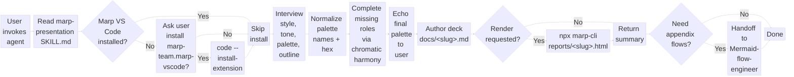

# Flow - Agent Marp-presentation-engineer

Source: [`.github/agents/Marp-presentation-engineer.agent.md`](../../.github/agents/Marp-presentation-engineer.agent.md)

```mermaid
%%{init: {'themeVariables': {'fontSize': '100px'}}}%%
flowchart LR
    A[User invokes agent] --> B[Read marp-presentation SKILL.md]
    B --> C{Marp VS Code<br/>installed?}
    C -- Yes --> D[Skip install]
    C -- No --> E[Ask user<br/>install marp-team.marp-vscode?]
    E -- Yes --> F[code --install-extension]
    E -- No --> D
    F --> D
    D --> G[Interview<br/>style, tone, palette, outline]
    G --> H[Normalize palette<br/>names + hex]
    H --> I[Complete missing roles<br/>via chromatic harmony]
    I --> J[Echo final palette<br/>to user]
    J --> K[Author deck<br/>docs/&lt;slug&gt;.md]
    K --> L{Render requested?}
    L -- No --> M[Return summary]
    L -- Yes --> N[npx marp-cli<br/>reports/&lt;slug&gt;.html]
    N --> M
    M --> O{Need appendix flows?}
    O -- Yes --> P[Handoff to<br/>Mermaid-flow-engineer]
    O -- No --> Q[Done]
    P --> Q
```
