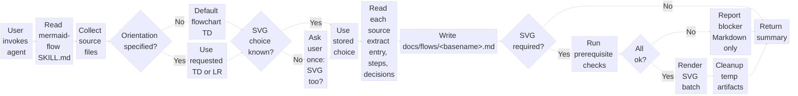

# Flow - Agent Mermaid-flow-engineer

Source: [`.github/agents/Mermaid-flow-engineer.agent.md`](../../.github/agents/Mermaid-flow-engineer.agent.md)

```mermaid
%%{init: {'themeVariables': {'fontSize': '100px'}}}%%
flowchart LR
    A[User invokes agent] --> B[Read mermaid-flow SKILL.md]
    B --> C[Collect source files]
    C --> D{Orientation specified?}
    D -- No --> E[Default flowchart TD]
    D -- Yes --> F[Use requested TD or LR]
    E --> G{SVG choice known?}
    F --> G
    G -- No --> H[Ask user once:<br/>SVG too?]
    G -- Yes --> I[Use stored choice]
    H --> I
    I --> J[Read each source<br/>extract entry, steps, decisions]
    J --> K[Write docs/flows/&lt;basename&gt;.md]
    K --> L{SVG required?}
    L -- No --> M[Return summary]
    L -- Yes --> N[Run prerequisite checks]
    N --> O{All ok?}
    O -- No --> P[Report blocker<br/>Markdown only]
    O -- Yes --> Q[Render SVG batch]
    Q --> R[Cleanup temp artifacts]
    P --> M
    R --> M
```
