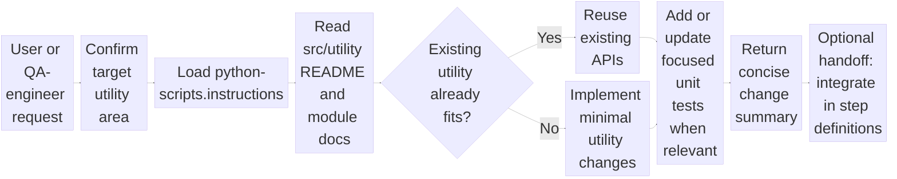

# Flow - Python Utility Engineer

Source: `.github/agents/Python-utility-engineer.agent.md`

```mermaid
%%{init: {'themeVariables': {'fontSize': '100px'}}}%%
flowchart LR
    A[User or QA-engineer request] --> B[Confirm target utility area]
    B --> C[Load python-scripts.instructions]
    C --> D[Read src/utility README and module docs]
    D --> E{Existing utility already fits?}
    E -- Yes --> F[Reuse existing APIs]
    E -- No --> G[Implement minimal utility changes]
    F --> H[Add or update focused unit tests when relevant]
    G --> H
    H --> I[Return concise change summary]
    I --> J[Optional handoff: integrate in step definitions]
```

