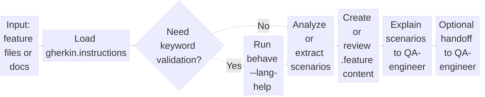

# Flow - QA Analyst

Source: `.github/agents/QA-analyst.agent.md`

```mermaid
%%{init: {'themeVariables': {'fontSize': '100px'}}}%%
flowchart LR
    A[Input: feature files or docs] --> B[Load gherkin.instructions]
    B --> C{Need keyword validation?}
    C -- Yes --> D[Run behave --lang-help <lang>]
    C -- No --> E[Analyze or extract scenarios]
    D --> E
    E --> F[Create or review .feature content]
    F --> G[Explain scenarios to QA-engineer]
    G --> H[Optional handoff to QA-engineer]
```

