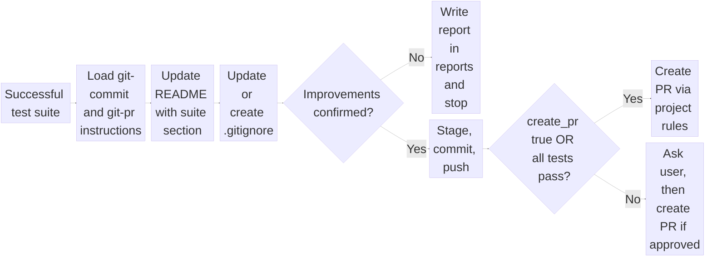

# Flow - QA Closer

Source: `.github/agents/QA-closer.agent.md`

```mermaid
%%{init: {'themeVariables': {'fontSize': '100px'}}}%%
flowchart LR
    A[Successful test suite] --> B[Load git-commit and git-pr instructions]
    B --> C[Update README with suite section]
    C --> D[Update or create .gitignore]
    D --> E{Improvements confirmed?}
    E -- No --> F[Write report in reports and stop]
    E -- Yes --> G[Stage, commit, push]
    G --> H{create_pr true OR all tests pass?}
    H -- Yes --> I[Create PR via project rules]
    H -- No --> J[Ask user, then create PR if approved]
```

