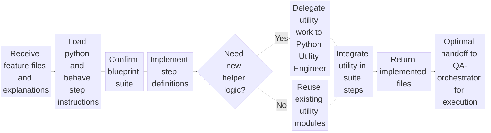

# Flow - QA Engineer

Source: `.github/agents/QA-engineer.agent.md`

```mermaid
%%{init: {'themeVariables': {'fontSize': '100px'}}}%%
flowchart LR
    A[Receive feature files and explanations] --> B[Load python and behave step instructions]
    B --> C[Confirm blueprint suite]
    C --> D[Implement step definitions]
    D --> E{Need new helper logic?}
    E -- Yes --> F[Delegate utility work to Python Utility Engineer]
    E -- No --> G[Reuse existing utility modules]
    F --> H[Integrate utility in suite steps]
    G --> H
    H --> I[Return implemented files]
    I --> J[Optional handoff to QA-orchestrator for execution]
```

