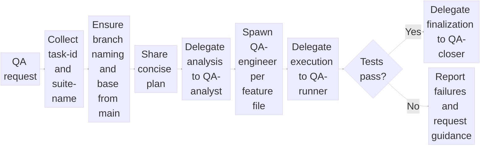

# Flow - QA Orchestrator

Source: `.github/agents/QA-orchestrator.agent.md`

```mermaid
%%{init: {'themeVariables': {'fontSize': '100px'}}}%%
flowchart LR
    A[QA request] --> B[Collect task-id and suite-name]
    B --> C[Ensure branch naming and base from main]
    C --> D[Share concise plan]
    D --> E[Delegate analysis to QA-analyst]
    E --> F[Spawn QA-engineer per feature file]
    F --> G[Delegate execution to QA-runner]
    G --> H{Tests pass?}
    H -- Yes --> I[Delegate finalization to QA-closer]
    H -- No --> J[Report failures and request guidance]
```

