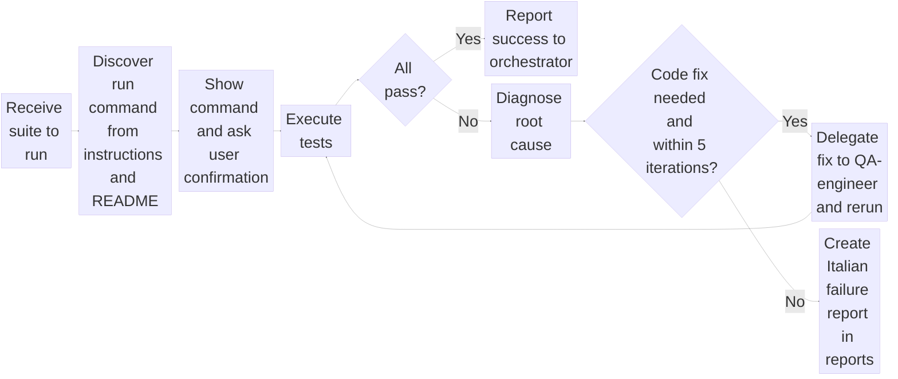

# Flow - QA Runner

Source: `.github/agents/QA-runner.agent.md`

```mermaid
%%{init: {'themeVariables': {'fontSize': '100px'}}}%%
flowchart LR
    A[Receive suite to run] --> B[Discover run command from instructions and README]
    B --> C[Show command and ask user confirmation]
    C --> D[Execute tests]
    D --> E{All pass?}
    E -- Yes --> F[Report success to orchestrator]
    E -- No --> G[Diagnose root cause]
    G --> H{Code fix needed and within 5 iterations?}
    H -- Yes --> I[Delegate fix to QA-engineer and rerun]
    I --> D
    H -- No --> J[Create Italian failure report in reports]
```

