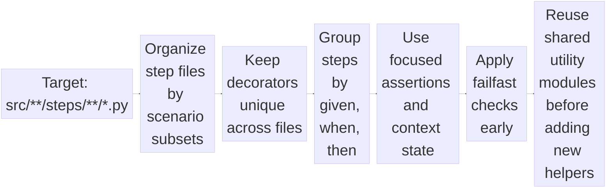

# Flow - behave-steps instructions

Source: `.github/instructions/behave-steps.instructions.md`

```mermaid
%%{init: {'themeVariables': {'fontSize': '100px'}}}%%
flowchart LR
    A[Target: src/**/steps/**/*.py] --> B[Organize step files by scenario subsets]
    B --> C[Keep decorators unique across files]
    C --> D[Group steps by given, when, then]
    D --> E[Use focused assertions and context state]
    E --> F[Apply failfast checks early]
    F --> G[Reuse shared utility modules before adding new helpers]
```

