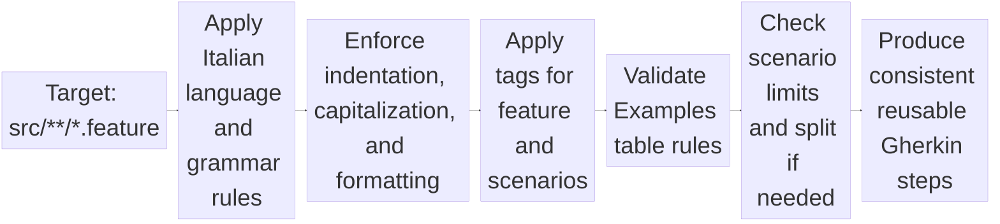

# Flow - gherkin instructions

Source: `.github/instructions/gherkin.instructions.md`

```mermaid
%%{init: {'themeVariables': {'fontSize': '100px'}}}%%
flowchart LR
    A[Target: src/**/*.feature] --> B[Apply Italian language and grammar rules]
    B --> C[Enforce indentation, capitalization, and formatting]
    C --> D[Apply tags for feature and scenarios]
    D --> E[Validate Examples table rules]
    E --> F[Check scenario limits and split if needed]
    F --> G[Produce consistent reusable Gherkin steps]
```

