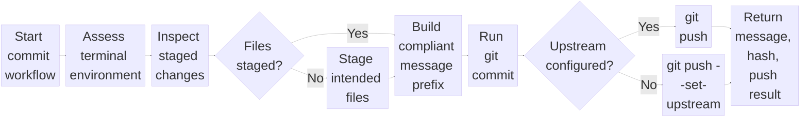

# Flow - git-commit instructions

Source: `.github/instructions/git-commit.instructions.md`

```mermaid
%%{init: {'themeVariables': {'fontSize': '100px'}}}%%
flowchart LR
    A[Start commit workflow] --> B[Assess terminal environment]
    B --> C[Inspect staged changes]
    C --> D{Files staged?}
    D -- No --> E[Stage intended files]
    D -- Yes --> F[Build compliant message prefix]
    E --> F
    F --> G[Run git commit]
    G --> H{Upstream configured?}
    H -- Yes --> I[git push]
    H -- No --> J[git push --set-upstream]
    I --> K[Return message, hash, push result]
    J --> K
```

