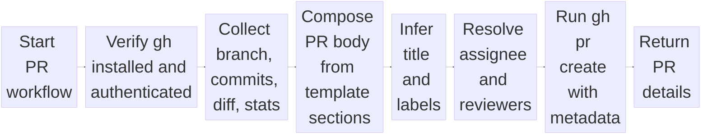

# Flow - git-pr instructions

Source: `.github/instructions/git-pr.instructions.md`

```mermaid
%%{init: {'themeVariables': {'fontSize': '100px'}}}%%
flowchart LR
    A[Start PR workflow] --> B[Verify gh installed and authenticated]
    B --> C[Collect branch, commits, diff, stats]
    C --> D[Compose PR body from template sections]
    D --> E[Infer title and labels]
    E --> F[Resolve assignee and reviewers]
    F --> G[Run gh pr create with metadata]
    G --> H[Return PR details]
```

