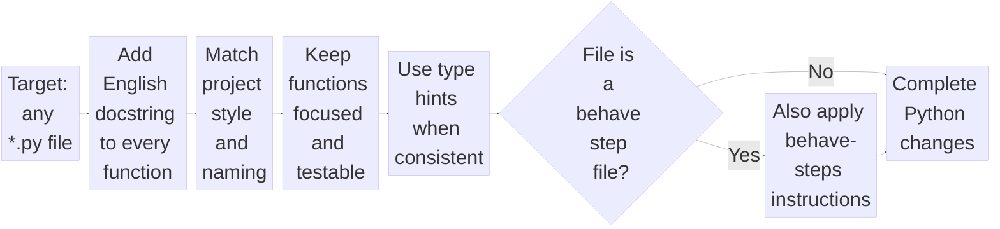

# Flow - python-scripts instructions

Source: `.github/instructions/python-scripts.instructions.md`

```mermaid
%%{init: {'themeVariables': {'fontSize': '100px'}}}%%
flowchart LR
    A[Target: any *.py file] --> B[Add English docstring to every function]
    B --> C[Match project style and naming]
    C --> D[Keep functions focused and testable]
    D --> E[Use type hints when consistent]
    E --> F{File is a behave step file?}
    F -- Yes --> G[Also apply behave-steps instructions]
    F -- No --> H[Complete Python changes]
    G --> H
```

