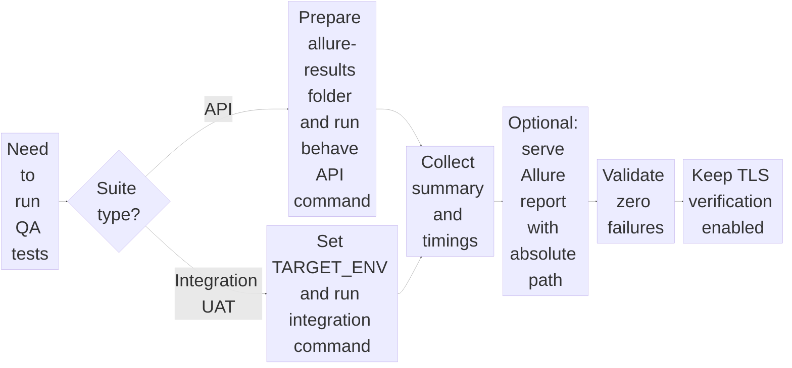

# Flow - run-tests instructions

Source: `.github/instructions/run-tests.instructions.md`

```mermaid
%%{init: {'themeVariables': {'fontSize': '100px'}}}%%
flowchart LR
    A[Need to run QA tests] --> B{Suite type?}
    B -- API --> C[Prepare allure-results folder and run behave API command]
    B -- Integration UAT --> D[Set TARGET_ENV and run integration command]
    C --> E[Collect summary and timings]
    D --> E
    E --> F[Optional: serve Allure report with absolute path]
    F --> G[Validate zero failures]
    G --> H[Keep TLS verification enabled]
```

