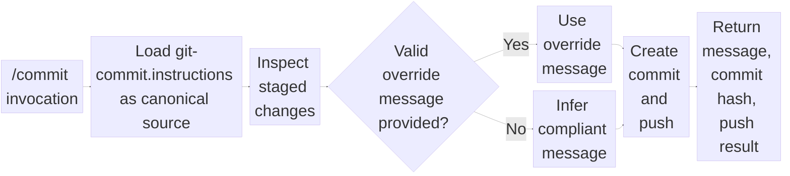

# Flow - commit prompt

Source: `.github/prompts/commit.prompt.md`

```mermaid
%%{init: {'themeVariables': {'fontSize': '100px'}}}%%
flowchart LR
    A["/commit invocation"] --> B[Load git-commit.instructions as canonical source]
    B --> C[Inspect staged changes]
    C --> D{Valid override message provided?}
    D -- Yes --> E[Use override message]
    D -- No --> F[Infer compliant message]
    E --> G[Create commit and push]
    F --> G
    G --> H[Return message, commit hash, push result]
```

