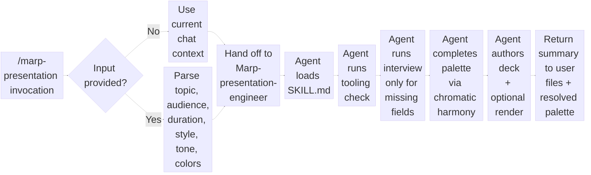

# Flow - Prompt /marp-presentation

Source: [`.github/prompts/marp-presentation.prompt.md`](../../.github/prompts/marp-presentation.prompt.md)

```mermaid
%%{init: {'themeVariables': {'fontSize': '100px'}}}%%
flowchart LR
    A["/marp-presentation invocation"] --> B{Input provided?}
    B -- No --> C[Use current chat context]
    B -- Yes --> D[Parse topic, audience,<br/>duration, style, tone, colors]
    C --> E[Hand off to<br/>Marp-presentation-engineer]
    D --> E
    E --> F[Agent loads SKILL.md]
    F --> G[Agent runs<br/>tooling check]
    G --> H[Agent runs interview<br/>only for missing fields]
    H --> I[Agent completes palette<br/>via chromatic harmony]
    I --> J[Agent authors deck<br/>+ optional render]
    J --> K[Return summary to user<br/>files + resolved palette]
```
