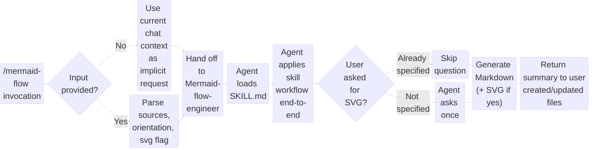

# Flow - Prompt /mermaid-flow

Source: [`.github/prompts/mermaid-flow.prompt.md`](../../.github/prompts/mermaid-flow.prompt.md)

```mermaid
%%{init: {'themeVariables': {'fontSize': '100px'}}}%%
flowchart LR
    A["/mermaid-flow invocation"] --> B{Input provided?}
    B -- No --> C[Use current chat context<br/>as implicit request]
    B -- Yes --> D[Parse sources,<br/>orientation, svg flag]
    C --> E[Hand off to Mermaid-flow-engineer]
    D --> E
    E --> F[Agent loads SKILL.md]
    F --> G[Agent applies skill<br/>workflow end-to-end]
    G --> H{User asked for SVG?}
    H -- Already specified --> I[Skip question]
    H -- Not specified --> J[Agent asks once]
    I --> K["Generate Markdown<br/>(+ SVG if yes)"]
    J --> K
    K --> L[Return summary to user<br/>created/updated files]
```
