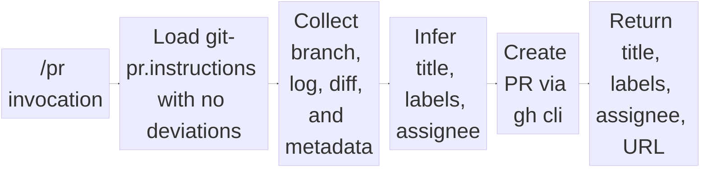

# Flow - pr prompt

Source: `.github/prompts/pr.prompt.md`

```mermaid
%%{init: {'themeVariables': {'fontSize': '100px'}}}%%
flowchart LR
    A["/pr invocation"] --> B[Load git-pr.instructions with no deviations]
    B --> C[Collect branch, log, diff, and metadata]
    C --> D[Infer title, labels, assignee]
    D --> E[Create PR via gh cli]
    E --> F[Return title, labels, assignee, URL]
```

