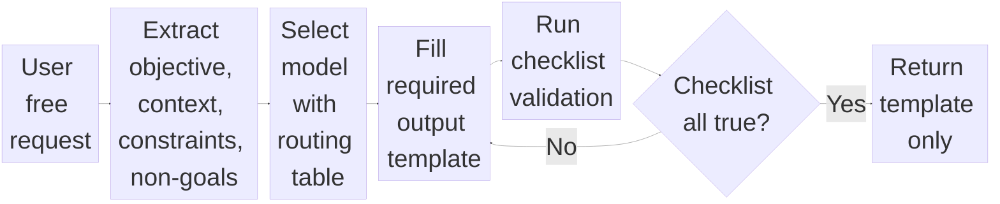

# Flow - promptize prompt

Source: `.github/prompts/promptize.prompt.md`

```mermaid
%%{init: {'themeVariables': {'fontSize': '100px'}}}%%
flowchart LR
    A[User free request] --> B[Extract objective, context, constraints, non-goals]
    B --> C[Select model with routing table]
    C --> D[Fill required output template]
    D --> E[Run checklist validation]
    E --> F{Checklist all true?}
    F -- Yes --> G[Return template only]
    F -- No --> D
```

