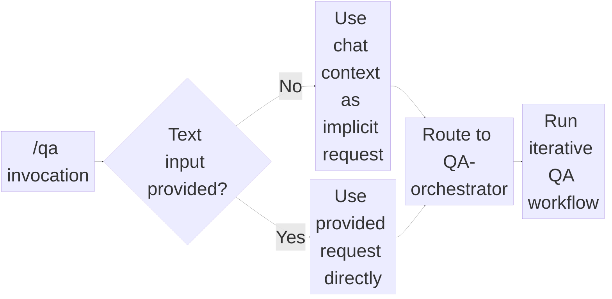

# Flow - qa prompt

Source: `.github/prompts/qa.prompt.md`

```mermaid
%%{init: {'themeVariables': {'fontSize': '100px'}}}%%
flowchart LR
    A["/qa invocation"] --> B{Text input provided?}
    B -- No --> C[Use chat context as implicit request]
    B -- Yes --> D[Use provided request directly]
    C --> E[Route to QA-orchestrator]
    D --> E
    E --> F[Run iterative QA workflow]
```

