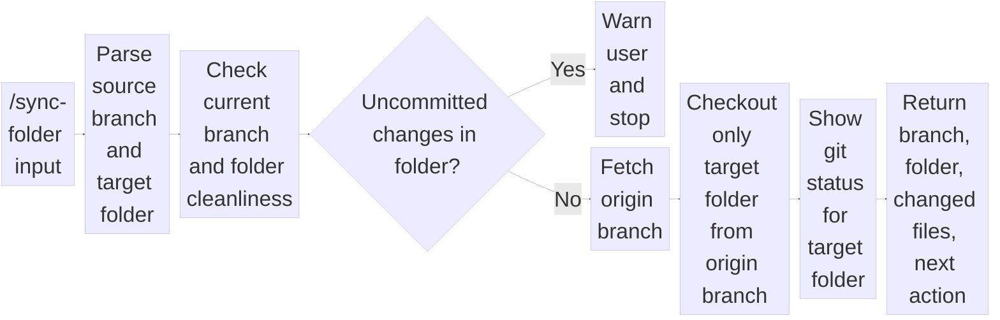

# Flow - sync-folder prompt

Source: `.github/prompts/sync-folder.prompt.md`

```mermaid
%%{init: {'themeVariables': {'fontSize': '100px'}}}%%
flowchart LR
    A["/sync-folder input"] --> B[Parse source branch and target folder]
    B --> C[Check current branch and folder cleanliness]
    C --> D{Uncommitted changes in folder?}
    D -- Yes --> E[Warn user and stop]
    D -- No --> F[Fetch origin branch]
    F --> G[Checkout only target folder from origin branch]
    G --> H[Show git status for target folder]
    H --> I[Return branch, folder, changed files, next action]
```

