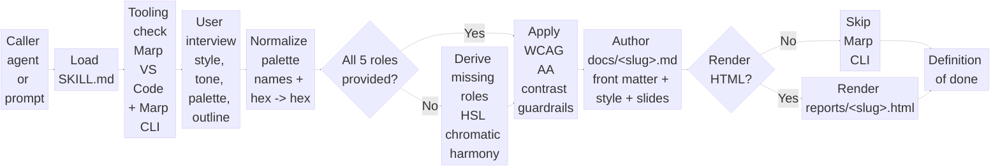

# Flow - Skill marp-presentation

Source: [`.github/skills/marp-presentation/SKILL.md`](../../.github/skills/marp-presentation/SKILL.md)

```mermaid
%%{init: {'themeVariables': {'fontSize': '100px'}}}%%
flowchart LR
    A[Caller agent or prompt] --> B[Load SKILL.md]
    B --> C[Tooling check<br/>Marp VS Code + Marp CLI]
    C --> D[User interview<br/>style, tone, palette, outline]
    D --> E[Normalize palette<br/>names + hex -> hex]
    E --> F{All 5 roles<br/>provided?}
    F -- No --> G[Derive missing roles<br/>HSL chromatic harmony]
    F -- Yes --> H[Apply WCAG AA<br/>contrast guardrails]
    G --> H
    H --> I[Author docs/&lt;slug&gt;.md<br/>front matter + style + slides]
    I --> J{Render HTML?}
    J -- No --> K[Skip Marp CLI]
    J -- Yes --> L[Render reports/&lt;slug&gt;.html]
    K --> M[Definition of done]
    L --> M
```
