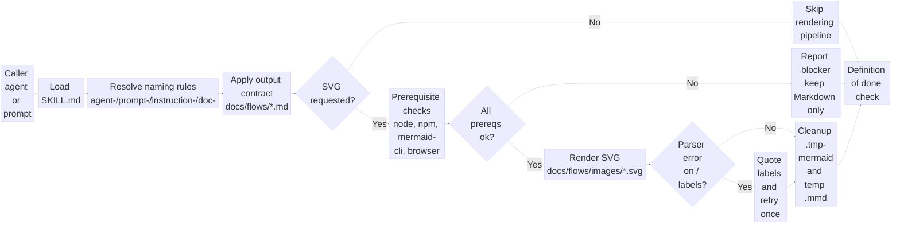

# Flow - Skill mermaid-flow

Source: [`.github/skills/mermaid-flow/SKILL.md`](../../.github/skills/mermaid-flow/SKILL.md)

```mermaid
%%{init: {'themeVariables': {'fontSize': '100px'}}}%%
flowchart LR
    A[Caller agent or prompt] --> B[Load SKILL.md]
    B --> C[Resolve naming rules<br/>agent-/prompt-/instruction-/doc-]
    C --> D[Apply output contract<br/>docs/flows/*.md]
    D --> E{SVG requested?}
    E -- No --> F[Skip rendering pipeline]
    E -- Yes --> G[Prerequisite checks<br/>node, npm, mermaid-cli, browser]
    G --> H{All prereqs ok?}
    H -- No --> I[Report blocker<br/>keep Markdown only]
    H -- Yes --> J[Render SVG<br/>docs/flows/images/*.svg]
    J --> K{Parser error<br/>on / labels?}
    K -- Yes --> L[Quote labels and retry once]
    K -- No --> M[Cleanup .tmp-mermaid<br/>and temp .mmd]
    L --> M
    F --> N[Definition of done check]
    I --> N
    M --> N
```
