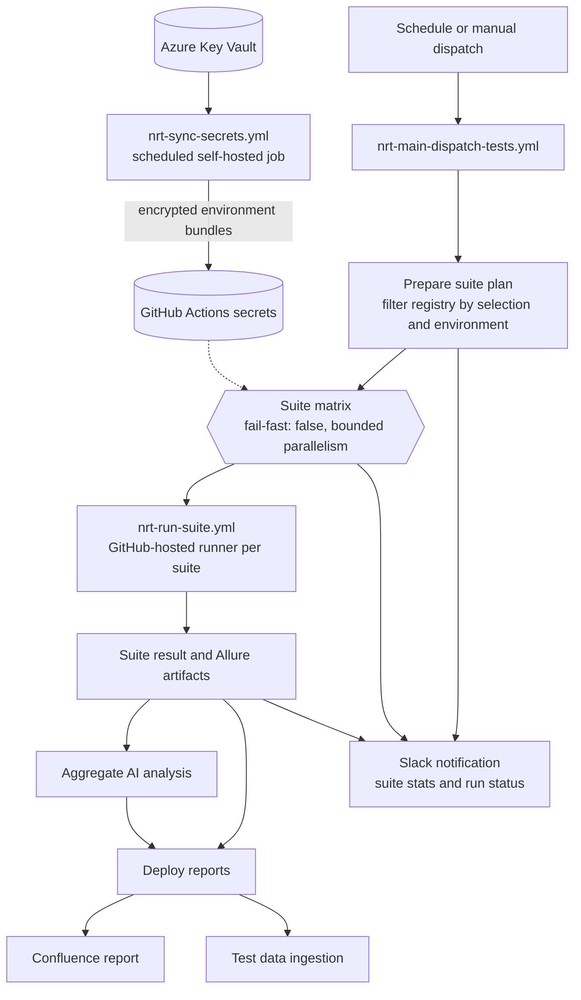

# No Regression Test (NRT) Process Architecture

| | |
|---|---|
| **Status** | Architecture baseline |
| **Repository** | `pagopa/pagopa-platform-integration-test` |
| **Scope** | NRT orchestration, suite execution, secrets, and reporting |

## 1. Purpose

This document describes the target architecture for running No Regression Tests across
multiple PagoPA components and target environments. It establishes the process boundaries
and contracts between workflows, test suites, secret distribution, and reporting.

The architecture is designed so that adding a suite is primarily a registry change rather
than a copy of an existing workflow. Test suites run on GitHub-hosted runners; a separate
scheduled self-hosted workflow accesses Azure Key Vault and refreshes encrypted GitHub
Actions secrets.

## 2. Architecture at a glance



The scheduled secret synchronization is independent of an NRT run. A failed refresh does
not block test execution with the last successfully published bundle; the bundle age is
reported so stale credentials are visible.

## 3. Workflow responsibilities

All new workflow files use the `nrt-` prefix and coexist with the current workflows until
the new process is adopted.

| Component | Responsibility |
|---|---|
| `.github/workflows/nrt-main-dispatch-tests.yml` | Manual NRT entry point; accepts suite selection and target environment; prepares the selected suite matrix; coordinates suite execution, final status, and Slack notification. Scheduling remains disabled until the legacy schedule is retired. |
| `.github/nrt-suites.json` | Declarative catalog of suite IDs, labels, Behave paths/tags, environment support, setup requirements, and dependency metadata. |
| `.github/workflows/nrt-run-suite.yml` | Reusable workflow containing the common setup, secret materialization, test execution, Allure generation, and artifact publication for one suite. |
| `.github/workflows/nrt-sync-secrets.yml` | Runs daily or manually on self-hosted runners; reads Key Vault values, builds and validates per-environment bundles, then updates the matching GitHub Environment secret using GitHub's LibSodium-encrypted REST API. |
| Existing report workflows | Consume NRT artifacts to publish reports, create the Confluence page, and ingest test data. They are downstream consumers, not suite definitions. |

The reusable workflow gives each suite an isolated job and runner. Shared job-level
permissions and dependencies remain explicit in the reusable workflow; suite-specific
values are passed as inputs from the registry.

## 4. Suite registry and execution model

### 4.1 Registry contract

The registry describes the work, not the workflow implementation. A suite entry should
include at least:

```json
{
  "id": "wisp",
  "label": "WISP",
  "behave_path": "src/integration/wisp",
  "tags": ["@runnable"],
  "allure_subfolder": "wisp-tests",
  "needs_playwright": false,
  "envs": ["dev", "uat"],
  "depends_on": [],
  "on_dependency_failure": "skip",
  "provides": [],
  "consumes": [],
  "resource_group": null
}
```

`id`, `label`, `behave_path`, `tags`, `allure_subfolder`, `needs_playwright`, and `envs`
define suite execution. The remaining fields establish an extensible dependency contract;
independent suites use the defaults shown above.

### 4.2 Matrix fan-out

A GitHub Actions matrix expands one job definition into one job for each entry in a list.
The prepare job filters the registry by the requested suites and environment, then emits a
JSON `include` list. Each object becomes one matrix job, with its properties available as
`matrix.<property>` in the reusable workflow call.

```yaml
strategy:
  fail-fast: false
  max-parallel: 10
  matrix: ${{ fromJSON(needs.prepare.outputs.suites) }}
```

`fail-fast: false` ensures that a failure in one suite does not cancel other suites.
`max-parallel` bounds load on both GitHub-hosted runners and shared test environments.
The matrix is limited to 256 jobs per workflow run; effective concurrency is also subject
to the organization's GitHub plan and current runner availability.

## 5. Target environment

The entry workflow accepts `target_env` (`dev` or `uat`), defaulting to `uat` for scheduled
runs. The prepare job excludes suites whose `envs` list does not contain the selected
environment. The reusable workflow sets `TARGET_ENV` and selects the matching secret
bundle.

Allure history is isolated by environment, for example `wisp-tests-uat` and
`wisp-tests-dev`, so runs against different environments do not overwrite each other's
trend data.

## 6. Secret synchronization and consumption

### 6.1 Synchronization flow

`nrt-sync-secrets.yml` runs daily on a self-hosted runner for each supported environment;
it can also be dispatched manually for one or both environments. The runner uses its
managed identity to access `https://pagopa-<short-env>-itn-qa-kv.vault.azure.net/`, where
`d` maps to `dev` and `u` maps to `uat`.

The workflow recursively scans `<env>.yaml` and `<env>.yml` files under `src/integration/`,
`src/e2e/`, and `src/api/` for the selected environment. Values starting with `$`, including
those nested in mappings and lists, declare secret placeholders; other values are ignored.
Placeholders are merged by name. Every placeholder must specify the actual
Key Vault secret name; lookup normalizes it to lowercase only. No prefix is added and
underscores are not converted to hyphens. Duplicate
placeholders are resolved only once; invalid or unresolved values fail the sync before the
GitHub secret is updated.

The merged result is one JSON bundle per environment, shaped as `{"dev": {...}}` or
`{"uat": {...}}`, published as `NRT_SECRETS_BUNDLE` in the matching GitHub Environment.
The GitHub REST API encrypts the value with the target Environment's LibSodium public key;
the workflow does not keep a separate decryption key or upload plaintext as an
artifact/output. Checkout currently declares no secret placeholders and adds no entries.

The workflow updates a bundle only after retrieval, mapping, and validation all succeed.
If a refresh fails, the previously published bundle remains usable. A failure notification
and a manual refresh trigger provide operational visibility and recovery.

### 6.2 Test-job consumption

The suite job selects the matching GitHub Environment and receives its `NRT_SECRETS_BUNDLE`
secret. NRT, TAS, and legacy Behave test jobs set `SECRETS_RESOLVER=dict`, which overrides
`AZURE_KEY_VAULT_URL` and prevents direct Key Vault access during test execution. TAS uses
the requested environment instead of the previous fixed `integration-tests` Environment.
The Environment's branch restrictions and approval policies apply to these jobs.

Before Behave, `nrt-prepare-secrets.py` validates the single-environment JSON bundle,
non-empty secret values, and the selected test path. It recursively checks the selected
environment's YAML/YML placeholders against the bundle,
then writes `config/.secrets.yaml` with mode `0600`. Invalid or missing credentials stop
the job before tests start; there is no fallback to the old GitHub secret or Key Vault.

The suite's environment YAML/YML files are the source of truth for synchronization and
preflight validation. They reference secret names with a `$` prefix while retaining their
application configuration keys; no separate `config/suites/` manifest is required. The resolver in
[`src/conf/configuration.py`](../../src/conf/configuration.py) selects the `dev` or `uat`
section using `TARGET_ENV`, preserving JSON secret names exactly.

Outside CI test jobs, `SECRETS_RESOLVER` defaults to `auto`: an Azure URL selects the Azure
resolver, otherwise local YAML/JSON credentials are loaded. Sync and verification keep
their existing Azure behavior. Confluence, ingestion, and non-Behave OpenAPI workflows
retain their own credential contracts and are not migrated by this cutover.

The plaintext file is created with restrictive permissions and removed after test and
report generation, including on failure. Secret values must not be printed, included in
step summaries, or placed in artifacts. GitHub Environment secrets have a 48 KB limit;
the generated bundle is checked against that limit before publication.

Local cutover regression tests use synthetic credentials only and can be run from the
repository root with `python .github/scripts/nrt-test-secrets.py -v`.

### 6.3 Published bundle verification

After a successful sync, start a new manual run of `nrt-verify-secrets.yml` and select
`dev` or `uat`. Its self-hosted job selects the matching GitHub Environment and executes
`nrt-sync-secrets.py --verify`. It reads `NRT_SECRETS_BUNDLE`, validates its JSON structure
and single-environment scope, then reconstructs the expected bundle from all suite
manifests and current Key Vault values using the same resolution logic as the sync.

The comparison requires identical keys and values. Only the environment, verified key
count, and mismatch counts are reported; no values or hashes are logged. This mode does
not update GitHub secrets, run tests, or upload artifacts. A mismatch can also indicate
that a Key Vault secret was rotated after the last sync. Verification and synchronization
share a per-environment concurrency group to prevent simultaneous execution.

## 7. Suite dependencies and resource coordination

The initial suite set is independent and runs in one matrix. The registry contract also
supports three future coordination cases.

### 7.1 Ordering dependency (C1)

If suite B must start only after suite A completes, `depends_on` expresses the directed
dependency. The prepare job validates the graph (including unknown IDs and cycles) and
groups suites into topological waves. Each wave runs as a matrix; later waves start only
after the preceding wave has completed.

GitHub Actions does not create jobs dynamically during a run, so the workflow must define
a bounded number of wave jobs or use a single orchestrator job for dependent suites. The
chosen implementation must fail clearly if a dependency graph exceeds its supported
depth. Wave boundaries are barriers: a wave waits for all jobs in the preceding wave, not
only the suite it directly depends on.

### 7.2 Runtime data handoff (C2)

Ordering alone does not transfer data between jobs. If B consumes a value created at
runtime by A, A publishes a named JSON handoff artifact and B downloads it before running.
The registry declares the contract with `provides` and `consumes`; the reusable workflow
exposes the downloaded files through `NRT_HANDOFF_DIR`.

The producer and consumer suites must implement the matching serialization contract.
Handoff artifacts contain test data only, never credentials, and use unique names scoped
to the workflow run and suite to avoid collisions.

For tightly coupled suites that share non-serializable state, such as a live browser
session, they may be represented as a sequential suite group in one job. This trades
parallelism and independent reporting for shared process state and should remain an
exception.

### 7.3 Shared-resource serialization (C3)

If suites compete for a shared environment resource but have no data dependency, the
registry identifies the resource with `resource_group`. The prepare/scheduling logic places
those suites in a serialized lane while allowing unrelated suites to continue in parallel.
This is distinct from `depends_on`: it expresses mutual exclusion, not an execution order.
The implementation must not rely on a GitHub Actions concurrency group as a FIFO queue
for an arbitrary number of matrix jobs.

### 7.4 Dependency outcomes

Each suite publishes an outcome record alongside its report artifacts. The outcome records
whether setup, test execution, and report generation succeeded. A downstream wave uses
these records to apply `on_dependency_failure` (`skip` or `run`) to dependent suites.
Missing or invalid outcome records are treated as dependency failures. Test failures remain
visible in the report and are propagated to the final workflow status after report
publication, rather than being silently converted to success by `continue-on-error`.

## 8. Reporting and workflow completion

Each suite job produces uniquely named artifacts containing its Allure results/report and
a compact outcome record. The report deployment stage downloads all artifacts for the
current workflow run and publishes the suite reports and updated Allure history. Suite
history is separated by both suite and environment.

AI analysis runs once after suite execution and consumes an aggregate prompt built from
the suite outcomes and relevant failures. If the input exceeds the model context limit,
the prompt is reduced to failed scenarios and diagnostics. The analysis is supplemental:
it does not replace the authoritative test outcome.

The NRT Slack notification runs after suite execution and final-status evaluation, even
when tests fail. During rollout, its heading is explicitly marked **NRT BETA TEST** so it
cannot be confused with the established production notification. It combines each outcome artifact with the corresponding Allure
`widgets/summary.json` to report suite status, passed/failed/skipped counts, duration, and a
link to the workflow run. It uses the existing `SLACK_INTEGRATION_TEST_WEBHOOK_URL` secret
and does not depend on the legacy report-deployment workflow.

Report publication, Confluence reporting, and test-data ingestion run with an
always-evaluate condition so test failures do not prevent diagnostic artifacts from being
published. A final status job evaluates required suite outcomes and reports the NRT run as
failed when required tests fail.

## 9. Operational constraints

- GitHub Actions permits at most 256 jobs in a matrix for a workflow run. The organization
  plan and concurrent usage determine how many can run at once.
- `max-parallel` is configured conservatively to protect shared environments as well as
  the runner quota.
- Test jobs have explicit `timeout-minutes`; the limit is set according to suite runtime
  and leaves time for report generation and cleanup.
- Dependency caches may be used for Python packages and Playwright browsers. Cache keys
  include dependency lockfiles and relevant runtime versions.
- The `gh-pages` checkout is shallow and sparse where only a suite's previous Allure
  history is needed. Retention of historical reports is managed separately from the test
  execution workflow.
- The secret synchronization workflow reports the last successful refresh time. NRT runs
  should surface bundle age and alert when the configured freshness threshold is exceeded.

## 10. Repository references

- [NRT workflow directory](../../.github/workflows/)
- [Current dispatch workflow](../../.github/workflows/main-dispatch-tests.yml)
- [Current WISP workflow](../../.github/workflows/wisp-tests.yml)
- [Current Checkout E2E workflow](../../.github/workflows/checkout-e2e-tests.yml)
- [Secret resolver](../../src/conf/configuration.py)
- [Configuration utility guidance](../../src/utility/config/README.md)