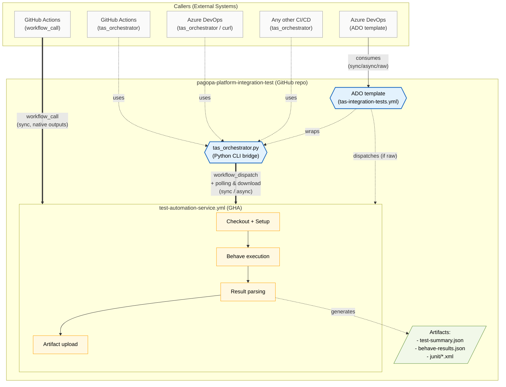

# Test Automation Service — Architecture

## Overview

The **Test Automation Service (TAS)** is a centralised integration testing infrastructure
hosted in the GitHub repository `pagopa-platform-integration-test`.

It exposes multiple integration interfaces so that any external system — a GitHub Actions
workflow, an Azure DevOps pipeline, or any other CI/CD tool — can trigger BDD test suites
(Behave + Playwright), wait for the outcome, and make decisions (e.g. block a deployment)
based on the results.

---

## Architecture diagram



---

## Components

### 1. `test-automation-service.yml` — Main workflow

The central GHA workflow that runs the test suites. It supports two trigger mechanisms:

| Trigger | Description |
|---|---|
| `workflow_call` | Synchronous invocation from another GHA workflow. Exposes typed outputs directly. |
| `workflow_dispatch` | Event-based invocation via the GitHub API. Fire-and-forget by nature; results are available as an artifact. |

**Inputs:**

| Name | Type | Required | Description |
|---|---|---|---|
| `test_suite` | string | ✅ | Test suite to run (`wisp`, `all`) |
| `environment` | string | ✅ | Target environment (`dev`, `uat`) |
| `caller_id` | string | ❌ | Identifier of the calling system for traceability |
| `correlation_id` | string | ❌ | Unique ID to correlate the run with the caller |

**Outputs** (available only via `workflow_call`):

| Name | Type | Description |
|---|---|---|
| `passed` | string | Number of passed scenarios |
| `failed` | string | Number of failed scenarios |
| `skipped` | string | Number of skipped scenarios |
| `total` | string | Total number of scenarios |
| `duration` | string | Total execution time in seconds |
| `outcome` | string | `success` or `failure` |

**Produced artifact:** `test-results` (zip), containing:
- `test-summary.json` — structured summary (see schema below)
- `behave-results.json` — raw Behave JSON output
- `junit/*.xml` — JUnit XML reports

### 2. `tas_orchestrator.py` — CLI bridge

A Python script that wraps the `workflow_dispatch` API with two operating modes:

| Mode | Flag | Behaviour |
|---|---|---|
| **Async** | _(default)_ | Sends the dispatch, prints `CORRELATION_ID` and `RUN_NAME`, exits with `0` immediately |
| **Sync** | `--sync` | Sends the dispatch, polls until completion, downloads the artifact, parses results, prints the summary, exits with `0` (success) or `1` (failure) |

The script uses the `run-name` field (set to `tas-{correlation_id}`) to locate the correct
run via the GitHub API, making it robust against concurrent executions.

**Dependencies:** `requests` (already included in `requirements.txt`)

**Required environment variable:** `GITHUB_TOKEN` — a PAT with scopes `repo` and `actions:read`.

### 3. `.azuredevops/templates/tas-integration-tests.yml` — Official ADO template

A reusable Azure DevOps stage template published by the TAS team. It encapsulates the
boilerplate that an Azure DevOps consumer would otherwise have to write by hand
(Python setup, orchestrator download, secret handling, JSON dispatch, output-variable
normalisation) behind a single, parameterised stage. Consumers reference it as a remote
resource via `resources.repositories` and invoke it as a stage; nothing else is needed
beyond a variable group with the PAT and a GitHub service connection.

| Aspect | Value |
|---|---|
| Path | `.azuredevops/templates/tas-integration-tests.yml` |
| Stage name (public contract) | `TAS_IntegrationTests` |
| Job name (public contract) | `RunTAS` |
| Output step name (public contract) | `tas` |
| Supported modes (`mode` parameter) | `sync`, `async`, `raw` |
| Normalised output variables | `CORRELATION_ID`, `RUN_ID` (sync only), `RUN_URL` (sync only) |

Internally the template selects the underlying invocation strategy:

- `mode: sync` and `mode: async` → wrap `tas_orchestrator.py`
- `mode: raw` → directly invoke `workflow_dispatch` via `curl`

In all three cases the template publishes outputs under the same step name (`tas`), so
the caller's `stageDependencies[...].outputs['tas.<NAME>']` paths are identical regardless
of the selected mode.

**Companion documentation:**
- [`.azuredevops/templates/README.md`](../../.azuredevops/templates/README.md) — public
  contract, prerequisites, versioning policy.
- [`docs/tas/tas-developer-guide.md`](./tas-developer-guide.md) — "Option 5 — Official
  Azure DevOps template" section.
- [`docs/tas/examples/tas-example-ado-using-template.yml`](./examples/tas-example-ado-using-template.yml)
  — ready-to-copy consumer pipeline.

---

## Artifact schema — `test-summary.json`

```json
{
  "correlation_id": "550e8400-e29b-41d4-a716-446655440000",
  "caller_id":      "pagopa-checkout",
  "suite":          "wisp",
  "environment":    "uat",
  "passed":         42,
  "failed":         0,
  "skipped":        3,
  "total":          45,
  "duration_seconds": 134.7,
  "outcome":        "success"
}
```

---

## Integration interfaces summary

| Interface | Caller type | Synchronous | Results accessible | Required infra |
|---|---|---|---|---|
| `workflow_call` | GHA only | ✅ | ✅ native outputs | None |
| `workflow_dispatch` (raw) | Any | ❌ | ❌ | None |
| `tas_orchestrator.py --sync` | Any CI/CD | ✅ | ✅ via stdout + exit code | Python + requests |
| `tas_orchestrator.py` (async) | Any CI/CD | ❌ | ❌ (correlation_id printed) | Python + requests |
| Official ADO template | Azure DevOps only | sync / async / raw (parameter) | ✅ via normalised output variables | GitHub service connection in the ADO project |

---

## Security

- All test secrets (environment credentials, endpoints, etc.) are stored in the
  `INTEGRATION_TESTS_SECRETS` secret inside the **`integration-tests` environment** of the
  centralised TAS repository. Callers do not need to configure or pass any test secret.
- The `run_tests` job declares `environment: integration-tests`: this ensures that the
  environment-level secrets of the TAS repo are available to the workflow even when it is
  invoked via `workflow_call` from an external repository.
- The `GITHUB_TOKEN` PAT used by `tas_orchestrator.py` must have the minimum required scopes:
  `repo` (to read run data) and `actions:read` (to list and download artifacts). It must be
  stored as a secret in the caller's CI/CD system and must never be hardcoded in plain text.
- The `correlation_id` is used exclusively to locate the run and contains no sensitive information.

