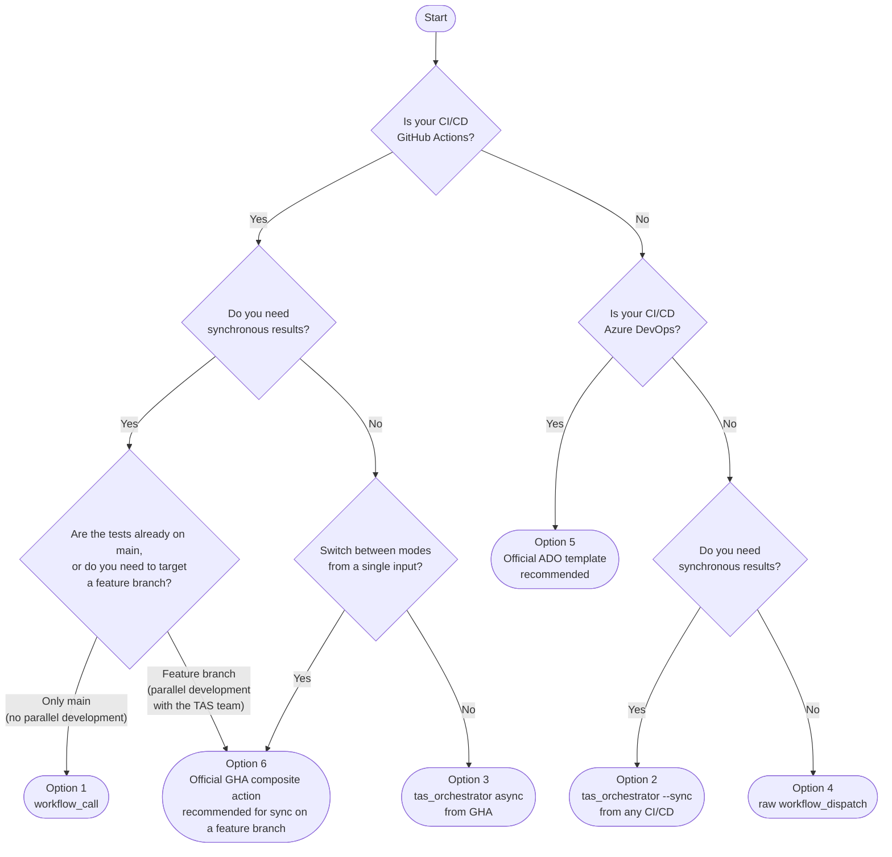

# Test Automation Service — Developer Guide

This guide is intended for external teams who want to integrate the **Test Automation Service (TAS)**
into their CI/CD pipelines. Before choosing an integration option, read the
[Which option should I choose?](#which-option-should-i-choose) section, which will guide you
through the decision using a flowchart.

---

## Prerequisites

### For all callers

- No test-related secrets to configure: test secrets are managed centrally in the
  `integration-tests` environment of the TAS repository, regardless of the integration
  mode used.
- The `pagopa/pagopa-platform-integration-test` repository is **public**: no special
  access is required to read it.

### For GitHub Actions callers (`workflow_call`)

- **No PAT required** to trigger the workflow and read its outputs: GitHub Actions orchestrates
  the call natively via the `uses:` directive, without going through external APIs.
- A PAT is only needed if you want to download the full report artifact from the TAS repo
  (see [Downloading the full report artifact](#downloading-the-full-report-artifact)).
  In that case the minimum required scopes are **`public_repo`** and **`actions:read`**.

### For callers using `tas_orchestrator.py` or raw `workflow_dispatch`

- Python 3.9+ and `pip install requests` (only for `tas_orchestrator.py`).
- A GitHub Personal Access Token (PAT) with scopes **`public_repo`** and **`actions:read`**,
  stored as a secret in the calling system (`INTEGRATION_TEST_PAT` in the examples below).
  A PAT is required because these modes trigger the workflow via the GitHub API, which
  requires authentication even on public repositories.

---

## Which option should I choose?

Use the following flowchart to identify the option that best fits your situation.



### Quick reference

| # | Option | Mode | Target branch | Caller | Results |
|---|---|---|---|---|---|
| **1** | `workflow_call` | Synchronous | `main` only (fixed) | GitHub Actions only | ✅ Native GHA outputs |
| **2** | `tas_orchestrator.py --sync` | Synchronous | Any branch ✅ | GHA / Azure DevOps / any | ✅ stdout + exit code |
| **3** | `tas_orchestrator.py` (async) | Asynchronous | Any branch ✅ | GHA / Azure DevOps / any | ❌ correlation_id only |
| **4** | `workflow_dispatch` (raw) | Asynchronous | Configurable in payload | Any | ❌ |
| **5** | Official ADO template | sync / async / raw (parameter) | Any branch ✅ | Azure DevOps only | ✅ Normalised output variables |
| **6** | Official GHA composite action | sync / async / raw (parameter) | Any branch ✅ | GitHub Actions only | ✅ Normalised step outputs |

---

## The target branch question

A crucial aspect to consider when choosing an integration option is the ability to specify
**which branch of the TAS repository** the tests should run from.

This becomes relevant when the team developing the product under test and the team writing
the tests are working **in parallel on separate feature branches**. At this stage, the new
tests are not yet available on `main` of the TAS repo: the calling team needs to be able to
point to the test feature branch — otherwise the pipeline would run outdated scenarios, or
worse, scenarios that do not yet cover the new functionality under development.

| Option | Target branch | Notes |
|---|---|---|
| `workflow_call` | **Fixed** — hardcoded in the `uses: ...@<ref>` directive in the caller's YAML | Cannot be made dynamic: **GitHub Actions limitation** |
| `tas_orchestrator.py` | **Dynamic** — `--ref` parameter at runtime | Ideal for parallel development |
| raw `workflow_dispatch` | **Configurable** — `"ref"` field in the JSON payload | Settable at runtime but fire-and-forget |
| Official ADO template | **Dynamic** — `ref` template parameter at runtime | Recommended for ADO callers |
| Official GHA composite action | **Dynamic** — `ref` action input at runtime | Recommended for GHA callers when Option 1 is not enough |

> **Recommendation for parallel development:** use option 2 (`tas_orchestrator.py --sync`)
> with the `--ref <feature-branch>` parameter — or, on GitHub Actions, the equivalent
> Option 6 composite action with `ref: <feature-branch>`. Once the feature branch is merged
> into `main`, simply remove the override (the default is already `main`) — no other
> changes to the pipeline needed.

---

## Option 1 — `workflow_call` from GitHub Actions (synchronous)

**When to use it:** your pipeline is GitHub Actions, you want to block execution and read the
results as native job outputs, and the tests you want to run are already available on `main`
of the TAS repository.

**How it works:** the calling job waits until `test-automation-service.yml` completes. If one
or more scenarios fail, the called workflow exits with code 1, which automatically fails the
calling job — exactly as if the test were part of your own pipeline. Results (passed, failed,
duration, outcome…) are available as named outputs in the `needs` context, ready to use in
downstream jobs without any additional logic.

**Main limitation:** the TAS repo branch on which the tests run is hardcoded in the `uses:`
directive. GitHub Actions does not support dynamic expressions in that field, so it is not
possible to choose at runtime which branch to run the tests on. If your team and the TAS team
are developing in parallel on separate feature branches, this option is not suitable until
that branch has been merged into `main`.

```yaml
# .github/workflows/deploy.yml  (in your repository)
name: Build, Test & Deploy

on:
  push:
    branches: [main]

jobs:

  # ── Step 1: run integration tests ─────────────────────────────────────────
  integration-tests:
    uses: pagopa/pagopa-platform-integration-test/.github/workflows/test-automation-service.yml@main
    with:
      test_suite: wisp           # wisp | all
      environment: uat           # dev | uat
      caller_id: ${{ github.repository }}
    # No secrets: to pass — test secrets live in the centralised TAS repository

  # ── Step 2: deploy only if tests passed ───────────────────────────────────
  deploy:
    needs: integration-tests
    runs-on: ubuntu-latest
    steps:
      - name: Show test results
        run: |
          echo "Passed   : ${{ needs.integration-tests.outputs.passed }}"
          echo "Failed   : ${{ needs.integration-tests.outputs.failed }}"
          echo "Skipped  : ${{ needs.integration-tests.outputs.skipped }}"
          echo "Total    : ${{ needs.integration-tests.outputs.total }}"
          echo "Duration : ${{ needs.integration-tests.outputs.duration }}s"
          echo "Outcome  : ${{ needs.integration-tests.outputs.outcome }}"

      - name: Deploy application
        run: ./deploy.sh
```

**Available outputs on `needs.integration-tests.outputs`:**

| Output | Example value | Description |
|---|---|---|
| `passed` | `42` | Passed scenarios |
| `failed` | `0` | Failed scenarios |
| `skipped` | `3` | Skipped scenarios |
| `total` | `45` | Total scenarios |
| `duration` | `134.7` | Execution time (seconds) |
| `outcome` | `success` | `success` or `failure` |

> **No PAT required** for `workflow_call` invocations: GitHub Actions handles the call
> natively. Test secrets are managed centrally in the `integration-tests` environment
> of the TAS repository.

---

## Option 2 — `tas_orchestrator.py --sync` (synchronous)

**When to use it:** you want synchronous behaviour with the full summary visible in the step
log, your pipeline is not GitHub Actions, or — a very common case during parallel development —
**you need to target a feature branch** of the TAS repo.

**How it works:** the Python script `tas_orchestrator.py` acts as a bridge between your CI/CD
and the GitHub Actions API. It sends a `workflow_dispatch` to `test-automation-service.yml`,
polls the run status every 15 seconds, downloads the results artifact upon completion, and
prints a summary to the log. If tests fail it exits with code 1, otherwise with 0 —
natively compatible with the `success()`/`failed()` logic of any pipeline.

The key parameter of this option is `--ref`: it lets you specify which branch of the TAS repo
to run the tests from. In a parallel development scenario, the calling team passes
`--ref feature/new-wisp-tests` to point to the test branch still in progress. Once that
branch is merged into `main`, simply remove the parameter (the default is already `main`).

### From GitHub Actions

```yaml
# .github/workflows/deploy.yml  (in your repository)
name: Build, Test & Deploy

on:
  push:
    branches: [main]

jobs:

  integration-tests:
    runs-on: ubuntu-latest
    steps:
      - name: Setup Python
        uses: actions/setup-python@v5
        with:
          python-version: "3.11"

      - name: Install orchestrator dependencies
        run: pip install requests

      - name: Download tas_orchestrator.py
        run: |
          curl -sSfL \
            "https://raw.githubusercontent.com/pagopa/pagopa-platform-integration-test/main/scripts/tas_orchestrator.py" \
            -o tas_orchestrator.py

      # Exit 0 = all tests passed   → job succeeds → deploy runs
      # Exit 1 = scenarios failed   → job fails    → deploy skipped
      # Exit 2 = orchestration error (config / timeout)
      - name: Run integration tests (sync)
        run: |
          python tas_orchestrator.py \
            --suite wisp \
            --env uat \
            --caller-id "${{ github.repository }}" \
            --sync
            # Add --ref <feature-branch> if tests are not yet on main
        env:
          GITHUB_TOKEN: ${{ secrets.INTEGRATION_TEST_PAT }}

  deploy:
    needs: integration-tests
    runs-on: ubuntu-latest
    steps:
      - name: Deploy application
        run: ./deploy.sh
```

**Example output printed in the step log:**

```
======================================================
   TEST AUTOMATION SERVICE — RESULTS SUMMARY
======================================================
   Correlation ID  : 3f2a1b4c-...
   Caller          : pagopa/pagopa-checkout
   Suite           : wisp
   Environment     : uat
------------------------------------------------------
   Passed          : 42
   Failed          : 0
   Skipped         : 3
   Total           : 45
   Duration        : 134.7s
------------------------------------------------------
   Outcome         : PASSED
======================================================
```

### From Azure DevOps

**Configuring the secret in Azure DevOps:**

1. Go to **Pipelines → Library → Variable Groups** (or directly to the pipeline variables).
2. Add a variable named `INTEGRATION_TEST_PAT` and mark it as **secret**.
3. Value: the GitHub PAT with scopes `public_repo` + `actions:read`.

```yaml
# azure-pipelines.yml  (in your ADO repository)
trigger: none

parameters:
  - name: suite
    type: string
    default: wisp
    values: [wisp, all]
  - name: environment
    type: string
    default: uat
    values: [dev, uat]
  - name: ref
    type: string
    default: main
    displayName: "TAS repo branch to run the tests from"

variables:
  PYTHON_VERSION: "3.11"
  TAS_REPO: "pagopa/pagopa-platform-integration-test"
  TAS_REF: ${{ parameters.ref }}

stages:

  # ── Stage 1: Integration tests ────────────────────────────────────────────
  - stage: IntegrationTests
    displayName: "Integration Tests"
    jobs:
      - job: RunTests
        displayName: "Trigger and wait for results"
        pool:
          vmImage: ubuntu-latest
        steps:
          - task: UsePythonVersion@0
            inputs:
              versionSpec: "$(PYTHON_VERSION)"

          - script: pip install requests
            displayName: "Install dependencies"

          - script: |
              curl -sSfL \
                "https://raw.githubusercontent.com/$(TAS_REPO)/$(TAS_REF)/scripts/tas_orchestrator.py" \
                -o tas_orchestrator.py
            displayName: "Download tas_orchestrator.py"

          - script: |
              python tas_orchestrator.py \
                --suite "${{ parameters.suite }}" \
                --env "${{ parameters.environment }}" \
                --ref "$(TAS_REF)" \
                --caller-id "$(Build.Repository.Name)/$(Build.BuildId)" \
                --sync
            displayName: "Run integration tests (sync)"
            env:
              GITHUB_TOKEN: $(INTEGRATION_TEST_PAT)

  # ── Stage 2: Deploy (runs only if IntegrationTests succeeded) ─────────────
  - stage: Deploy
    displayName: "Deploy"
    dependsOn: IntegrationTests
    condition: succeeded()
    jobs:
      - job: DeployApp
        pool:
          vmImage: ubuntu-latest
        steps:
          - script: echo "Deploying..."
            displayName: "Deploy"
```

---

## Option 3 — `tas_orchestrator.py` (async)

**When to use it:** you want to trigger tests without waiting for their outcome — for example
to run them in parallel with other jobs, to gain observability without blocking the deploy,
or purely for monitoring purposes.

**How it works:** the script sends the `workflow_dispatch` and returns immediately with exit
code 0, without waiting for completion. It prints `CORRELATION_ID` and `RUN_NAME`
(`tas-{correlation_id}`) to stdout, which you can use to track or locate the run later.
This mode also supports `--ref` to target a specific feature branch.

### From GitHub Actions

```yaml
jobs:
  trigger-tests:
    runs-on: ubuntu-latest
    outputs:
      correlation_id: ${{ steps.trigger.outputs.correlation_id }}
    steps:
      - uses: actions/setup-python@v5
        with: { python-version: "3.11" }

      - run: pip install requests

      - run: |
          curl -sSfL \
            "https://raw.githubusercontent.com/pagopa/pagopa-platform-integration-test/main/scripts/tas_orchestrator.py" \
            -o tas_orchestrator.py

      - name: Trigger tests (fire-and-forget)
        id: trigger
        run: |
          OUTPUT=$(python tas_orchestrator.py \
            --suite wisp \
            --env uat \
            --caller-id "${{ github.repository }}")
            # Add --ref <feature-branch> if needed
          echo "$OUTPUT"
          CORRELATION_ID=$(echo "$OUTPUT" | grep '^CORRELATION_ID=' | cut -d= -f2)
          echo "correlation_id=$CORRELATION_ID" >> "$GITHUB_OUTPUT"
        env:
          GITHUB_TOKEN: ${{ secrets.INTEGRATION_TEST_PAT }}

      - name: Continue without waiting
        run: |
          echo "Tests triggered in background."
          echo "Monitor at: https://github.com/pagopa/pagopa-platform-integration-test/actions"
          echo "Correlation ID: ${{ steps.trigger.outputs.correlation_id }}"
```

> **Note:** in async mode the script always exits with `0`. The caller does not block and
> cannot determine the test outcome from the exit code.

### From Azure DevOps

```yaml
stages:
  - stage: TriggerTests
    jobs:
      - job: FireAndForget
        pool:
          vmImage: ubuntu-latest
        steps:
          - task: UsePythonVersion@0
            inputs: { versionSpec: "3.11" }

          - script: pip install requests
            displayName: "Install dependencies"

          - script: |
              curl -sSfL \
                "https://raw.githubusercontent.com/pagopa/pagopa-platform-integration-test/main/scripts/tas_orchestrator.py" \
                -o tas_orchestrator.py
            displayName: "Download tas_orchestrator.py"

          - script: |
              python tas_orchestrator.py \
                --suite wisp \
                --env uat \
                --caller-id "$(Build.Repository.Name)"
                # Add --ref <feature-branch> if needed
              # Prints CORRELATION_ID=<uuid> — save it if you want to track the run later
            displayName: "Trigger tests (async)"
            env:
              GITHUB_TOKEN: $(INTEGRATION_TEST_PAT)

  - stage: ContinueImmediately
    dependsOn: TriggerTests
    jobs:
      - job: NextStep
        pool: { vmImage: ubuntu-latest }
        steps:
          - script: echo "Tests triggered in background, pipeline continues."
```

---

## Option 4 — Raw `workflow_dispatch` (fire-and-forget, no script)

**When to use it:** maximum simplicity, no results needed, just trigger the tests.
This is the option with the fewest dependencies: no Python, no additional script required.

**How it works:** a direct HTTP call is sent to the GitHub Actions API. The API responds
immediately with `HTTP 204 No Content` — no `run_id` is returned. The `"ref"` field in the
payload determines which branch of the TAS repo the tests run from and can be set freely
at runtime.

### From GitHub Actions

```yaml
steps:
  - name: Trigger integration tests
    run: |
      curl -X POST \
        -H "Accept: application/vnd.github+json" \
        -H "Authorization: Bearer ${{ secrets.INTEGRATION_TEST_PAT }}" \
        -H "X-GitHub-Api-Version: 2022-11-28" \
        -d '{
          "ref": "main",
          "inputs": {
            "test_suite": "wisp",
            "environment": "uat",
            "caller_id": "${{ github.repository }}"
          }
        }' \
        https://api.github.com/repos/pagopa/pagopa-platform-integration-test/actions/workflows/test-automation-service.yml/dispatches
```

### From Azure DevOps (curl)

```yaml
- script: |
    curl -X POST \
      -H "Authorization: Bearer $(INTEGRATION_TEST_PAT)" \
      -H "Accept: application/vnd.github+json" \
      -H "X-GitHub-Api-Version: 2022-11-28" \
      -d '{
        "ref": "main",
        "inputs": {
          "test_suite": "wisp",
          "environment": "uat",
          "caller_id": "my-ado-pipeline"
        }
      }' \
      https://api.github.com/repos/pagopa/pagopa-platform-integration-test/actions/workflows/test-automation-service.yml/dispatches
  displayName: "Trigger integration tests (fire-and-forget)"
```

> The API returns `HTTP 204 No Content` on success. No run_id is returned.
> Monitor the triggered run at:
> `https://github.com/pagopa/pagopa-platform-integration-test/actions`

---

## Option 5 — Official Azure DevOps template (recommended for ADO callers)

**When to use it:** your CI/CD is **Azure DevOps** and you want the simplest,
most maintainable integration. The TAS team publishes an official ADO template
that encapsulates the boilerplate of Options 2, 3 and 4 (Python setup,
orchestrator download, secret handling, JSON dispatch, output normalisation)
behind a single, parameterised entry point. Your pipeline only declares
parameters and consumes the standardised outputs.

**How it works:** your pipeline references the template as a remote resource
via `resources.repositories`, then invokes it as a stage with the desired
`mode` parameter (`sync`, `async`, or `raw`). The template adds a stage
named `TAS_IntegrationTests` containing a single job `RunTAS` with the
relevant steps. Internally the template selects between the three invocation
modes using compile-time conditionals, but exposes the **same** output
variable names on the **same** step name (`tas`), so the caller's
`stageDependencies[...].outputs['tas.<NAME>']` paths are identical regardless
of the mode selected.

### Prerequisites

In addition to the standard prerequisites for `tas_orchestrator.py` callers
(PAT, variable group), Azure DevOps needs to be able to fetch the template
from the TAS GitHub repository:

1. **Variable group `tas-integration-secrets`** containing
   `INTEGRATION_TEST_PAT` (secret). Authorise the pipeline:
   *Library → Variable group → Pipeline permissions → +*.
2. **GitHub service connection** in the ADO project:
   *Project settings → Service connections → New service connection → GitHub*.
   Note the connection name (e.g. `pagoPA-projects`) — it goes into the
   `endpoint:` field below. If your project already exposes a shared
   GitHub connection (it typically does), reuse it instead of creating
   a new one.

### Caller pipeline

```yaml
# azure-pipelines-integration-tests.yml  (in your ADO repository)
trigger: none
pr: none

parameters:
  - name: suite
    type: string
    default: wisp
    values: [wisp, all]
  - name: environment
    type: string
    default: uat
    values: [dev, uat]
  - name: mode
    type: string
    default: sync
    values: [sync, async, raw]
  - name: ref
    type: string
    default: main

resources:
  repositories:
    - repository: tas
      type: github
      name: pagopa/pagopa-platform-integration-test
      ref: refs/heads/main          # or refs/tags/v1 for a pinned version
      endpoint: pagoPA-projects     # GitHub service connection name

stages:
  - template: .azuredevops/templates/tas-integration-tests.yml@tas
    parameters:
      suite:       ${{ parameters.suite }}
      environment: ${{ parameters.environment }}
      mode:        ${{ parameters.mode }}
      ref:         ${{ parameters.ref }}

  - stage: Deploy
    dependsOn: TAS_IntegrationTests
    condition: succeeded()
    jobs:
      - job: DeployApp
        pool: { vmImage: ubuntu-latest }
        variables:
          # Output variables exposed by the template (step name normalised to 'tas'):
          CORRELATION_ID: $[ stageDependencies.TAS_IntegrationTests.RunTAS.outputs['tas.CORRELATION_ID'] ]
          RUN_ID:         $[ stageDependencies.TAS_IntegrationTests.RunTAS.outputs['tas.RUN_ID'] ]
          RUN_URL:        $[ stageDependencies.TAS_IntegrationTests.RunTAS.outputs['tas.RUN_URL'] ]
        steps:
          - script: |
              echo "Correlation ID : $(CORRELATION_ID)"
              echo "Run ID         : $(RUN_ID)"
              echo "Run URL        : $(RUN_URL)"
              ./deploy.sh
            displayName: "Deploy"
```

A ready-to-copy version is available at
[`docs/tas/examples/tas-example-ado-using-template.yml`](examples/tas-example-ado-using-template.yml).
The template itself, its public contract and the versioning policy are
documented in
[`.azuredevops/templates/README.md`](../../.azuredevops/templates/README.md).

### Template parameters

| Parameter | Type | Default | Description |
|---|---|---|---|
| `suite` | string | `wisp` | Test suite: `wisp` or `all` |
| `environment` | string | `uat` | Target environment: `dev` or `uat` |
| `mode` | string | `sync` | Invocation mode: `sync`, `async`, or `raw` |
| `ref` | string | `main` | TAS repo branch/tag to run the tests from |
| `secretsGroup` | string | `tas-integration-secrets` | Variable group containing `INTEGRATION_TEST_PAT` |
| `pythonVersion` | string | `3.11` | Python version used for orchestrator-based modes |
| `tasRepo` | string | `pagopa/pagopa-platform-integration-test` | TAS repository (rarely overridden) |
| `workflowFile` | string | `test-automation-service.yml` | TAS workflow file (rarely overridden) |
| `poolVmImage` | string | `ubuntu-latest` | Agent image used by the test job |
| `publishTests` | boolean | `true` | Publish JUnit results to the ADO **Tests** tab via `PublishTestResults@2` (sync only — silently ignored in async/raw) |
| `testRunTitle` | string | `""` | Title of the published test run. Empty = `TAS — <suite> / <env> (<ref>)` |

### Public contract (output variables)

The template normalises the step that publishes outputs to `name: tas`,
so the caller always reads from the same path regardless of `mode`:

```
stageDependencies.TAS_IntegrationTests.RunTAS.outputs['tas.<NAME>']
```

| Variable | `sync` | `async` | `raw` | Description |
|---|:---:|:---:|:---:|---|
| `CORRELATION_ID` | ✅ | ✅ | ✅ | Identifier used to locate the run (`run-name: tas-<id>`) |
| `RUN_ID` | ✅ | — | — | GHA workflow run numeric ID (useful to fetch artifacts) |
| `RUN_URL` | ✅ | — | — | Direct URL to the GHA run |
| `ARTIFACT_DIR` | ✅ | — | — | On-agent path where the TAS artifact (`test-summary.json`, `behave-results.json`, `junit/*.xml`) is extracted |

In modes where a variable is not produced, the value is an **empty string**:
downstream jobs can branch on it with `condition: ne(variables.RUN_ID, '')`.

### Mode-specific behaviour

| Aspect | `sync` | `async` | `raw` |
|---|:---:|:---:|:---:|
| Bootstraps Python + downloads `tas_orchestrator.py` | ✅ | ✅ | — (uses `curl` only) |
| Test outcome propagates to the stage exit code | ✅ | ❌ (dispatch-only) | ❌ (dispatch-only) |
| `Deploy` stage gated by test results via `succeeded()` | ✅ | ❌ (gated by dispatch only) | ❌ (gated by dispatch only) |
| Suitable when test results must block downstream stages | ✅ | ❌ | ❌ |
| Suitable for fire-and-forget / observability runs | ❌ | ✅ | ✅ |
| Requires Python on the agent | ✅ | ✅ | ❌ |

### Versioning

Pin the template to a tag for reproducible builds:

```yaml
resources:
  repositories:
    - repository: tas
      type: github
      name: pagopa/pagopa-platform-integration-test
      ref: refs/tags/v1
      endpoint: pagoPA-projects
```

Breaking changes to the template's public contract (stage/job/step names,
parameter names, output variables) are released under a new major tag
(`v1` → `v2`). Internal refactors that preserve the contract are released
on the same tag.

### Why prefer Option 5 over Options 2/3/4 on Azure DevOps

| Concern | Options 2/3/4 (per-pipeline YAML) | Option 5 (template) |
|---|---|---|
| Lines of YAML in the caller | ~80 | ~15 |
| Risk of `variables:` mapping/sequence syntax mistakes | High (caused HTTP 401 in practice) | None (template handles it) |
| Risk of leaking the PAT into the rendered shell script | Possible if `$(VAR)` is used instead of `$VAR` | None (template uses the safe pattern) |
| Output variable path depends on the mode chosen | Yes (`trigger.*` vs `dispatch.*` vs n/a) | No (always `tas.*`) |
| Centralised upgrade when the orchestrator CLI evolves | Each caller must update its YAML | All callers benefit transparently |
| Native ADO **Tests** tab populated automatically | No (caller must wire `PublishTestResults@2`, find the JUnit path, …) | Yes — built-in in sync mode |

### Test reporting (ADO "Tests" tab)

In `mode: sync` the template enables the Azure DevOps **Tests** tab on the
build summary out of the box:

1. The orchestrator step downloads the TAS artifact and extracts it under
   `$(Agent.TempDirectory)/tas-artifact` (`test-summary.json`,
   `behave-results.json`, `junit/*.xml`). The path is also exposed as the
   output variable `ARTIFACT_DIR`.
2. A `PublishTestResults@2` task runs with `condition: always()` against
   `junit/*.xml`, so the tab is populated even when the orchestrator step
   exits 1 on test failure — that is exactly the case the developer wants
   to inspect from the portal.

Customise the title shown on the portal with the `testRunTitle` parameter
(empty = `TAS — <suite> / <env> (<ref>)`). Opt out entirely with
`publishTests: false` (the artifact is still extracted, so `ARTIFACT_DIR`
remains usable for custom downstream logic).

> The publish step is added at compile time only when both `mode == 'sync'`
> and `publishTests == true`. In `async` / `raw` the dispatch returns before
> the artifact exists, so there is nothing to publish — the parameter is
> silently ignored in those modes.

---

## Option 6 — Official GitHub Actions composite action (recommended for advanced GHA callers)

**When to use it:** your CI/CD is **GitHub Actions** and Option 1
(`workflow_call`) is not enough — typically because you need to target a
feature branch of the TAS repo at runtime (parallel development), or
because you want a single switchable entry point that can run in `sync`,
`async`, or `raw` mode depending on a workflow input. The TAS team
publishes an official GHA composite action that encapsulates the same
boilerplate as Options 2, 3 and 4 (Python setup, orchestrator download,
supply-chain verification, secret wiring and stdout parsing) behind a
single step.

> **Reminder:** if your tests are already merged on `main` of the TAS
> repo and you do not need a dynamic `ref`, prefer **Option 1**: it is
> lighter, does not require a PAT, and natively exposes the same numeric
> outputs (`passed`, `failed`, …).

**How it works:** the action is referenced via `uses:` from any step in
your job. Internally it picks between the three invocation strategies
based on the `mode` input, but exposes the **same** output names
(`correlation_id`, `run_id`, `run_url`, `outcome`, `passed`, `failed`,
`skipped`, `total`, `duration`) on the same step ID, so the caller's
`steps.<id>.outputs.*` paths stay identical regardless of the mode. In
`sync` mode the action propagates the orchestrator's exit code, so the
job fails on test failure exactly like Option 1.

### Prerequisites

- **`INTEGRATION_TEST_PAT`** secret in the caller's repository, with
  scopes `public_repo` + `actions:read`. The PAT is required because all
  three modes trigger the TAS workflow via the GitHub API. Composite
  actions cannot read caller secrets implicitly, so the token must be
  passed via the `github_token` input.

### Caller workflow

```yaml
# .github/workflows/deploy.yml  (in your repository)
name: Build, Integration Test & Deploy

on:
  push:
    branches: [main]
  workflow_dispatch:
    inputs:
      mode:
        type: choice
        options: [sync, async, raw]
        default: sync
      ref:
        type: string
        default: main

jobs:
  integration-tests:
    runs-on: ubuntu-latest
    steps:
      - name: Run TAS
        id: tas
        # Pin to a tag (e.g. @v1) for reproducible builds, or track @main
        # to always get the latest version of the action.
        uses: pagopa/pagopa-platform-integration-test/.github/actions/tas-integration-tests@main
        with:
          suite:        wisp
          environment:  uat
          mode:         ${{ inputs.mode || 'sync' }}
          ref:          ${{ inputs.ref  || 'main' }}
          github_token: ${{ secrets.INTEGRATION_TEST_PAT }}
        # The action automatically logs a run summary (sync) or dispatch
        # info (async/raw) at the end. Set `print_summary: "false"` to
        # opt out and consume `steps.tas.outputs.*` yourself.

  deploy:
    needs: integration-tests
    # In sync mode the action fails the step on test failure, so `needs:`
    # already gates the deploy. In async/raw modes only the dispatch
    # outcome is gated.
    if: needs.integration-tests.result == 'success'
    runs-on: ubuntu-latest
    steps:
      - name: Deploy
        run: ./deploy.sh
```

A ready-to-copy version is available at
[`docs/tas/examples/tas-example-gha-using-template.yml`](examples/tas-example-gha-using-template.yml).
The action itself, its public contract and the versioning policy are
documented in
[`.github/actions/tas-integration-tests/README.md`](../../.github/actions/tas-integration-tests/README.md).

### Action inputs

| Input | Default | Required | Description |
|---|---|:---:|---|
| `suite` | `wisp` | — | Test suite: `wisp` or `all` |
| `environment` | `uat` | — | Target environment: `dev` or `uat` |
| `mode` | `sync` | — | Invocation mode: `sync`, `async`, or `raw` |
| `ref` | `main` | — | TAS repo branch/tag to run the tests from |
| `github_token` | — | ✅ | GitHub PAT (`public_repo` + `actions:read`) |
| `caller_id` | `${{ github.repository }}/${{ github.run_id }}` | — | Identifier of the calling system |
| `correlation_id` | `${{ github.run_id }}-${{ github.run_attempt }}` | — | Unique ID to correlate the run |
| `tas_repo` | `pagopa/pagopa-platform-integration-test` | — | TAS repository (rarely overridden) |
| `workflow_file` | `test-automation-service.yml` | — | TAS workflow file (rarely overridden) |
| `python_version` | `3.11` | — | Python version (orchestrator-based modes only) |
| `verify_orchestrator` | `true` | — | Verify SHA-256 of `tas_orchestrator.py` after download |
| `orchestrator_sha256` | `""` | — | Pinned SHA-256 hex digest (true SRI) |
| `print_summary` | `true` | — | Log the run summary (sync) or dispatch info (async/raw) automatically — set to `"false"` to opt out |

### Public contract (step outputs)

The action exposes the following outputs, read from the step ID:

```
steps.<id>.outputs.<NAME>
```

| Output | `sync` | `async` | `raw` | Description |
|---|:---:|:---:|:---:|---|
| `correlation_id` | ✅ | ✅ | ✅ | Identifier used to locate the run (`run-name: tas-<id>`) |
| `run_id` | ✅ | — | — | GHA workflow run numeric ID (useful to fetch artifacts) |
| `run_url` | ✅ | — | — | Direct URL to the GHA run |
| `outcome` | ✅ | — | — | `success` or `failure` |
| `passed` / `failed` / `skipped` / `total` / `duration` | ✅ | — | — | Numeric counters parsed from the TAS artifact |

In modes where an output is not produced, the value is an **empty string**:
downstream steps can branch on it with `if: steps.tas.outputs.run_id != ''`.

### Mode-specific behaviour

| Aspect | `sync` | `async` | `raw` |
|---|:---:|:---:|:---:|
| Bootstraps Python + downloads `tas_orchestrator.py` | ✅ | ✅ | — (uses `curl` only) |
| Test outcome propagates to the step exit code | ✅ | ❌ (dispatch-only) | ❌ (dispatch-only) |
| Downstream jobs gated by test results via `needs.*.result` | ✅ | ❌ (gated by dispatch only) | ❌ (gated by dispatch only) |
| Suitable when test results must block deployment | ✅ | ❌ | ❌ |
| Suitable for fire-and-forget / observability runs | ❌ | ✅ | ✅ |
| Requires Python on the runner | ✅ | ✅ | ❌ |

### Versioning

Pin the action to a tag for reproducible builds:

```yaml
uses: pagopa/pagopa-platform-integration-test/.github/actions/tas-integration-tests@v1
```

Breaking changes to the action's public contract (input/output names,
removal of modes) are released under a new major tag (`v1` → `v2`).
Internal refactors that preserve the contract are released on the same tag.

### Why prefer Option 6 over Options 2/3 on GitHub Actions

| Concern | Options 2/3 (per-workflow YAML) | Option 6 (composite action) |
|---|---|---|
| Lines of YAML in the caller | ~40 | ~10 |
| Risk of forgetting the SHA-256 verification of the orchestrator | High | None (built-in, toggleable) |
| Step output path depends on the mode chosen | Yes (`trigger.*` vs `dispatch.*`) | No (always the same step ID) |
| Centralised upgrade when the orchestrator CLI evolves | Each caller must update its YAML | All callers benefit transparently |
| Numeric outputs (`passed`, `failed`, …) parsed for you | No (caller must parse stdout) | Yes (exposed as step outputs) |

---

## Downloading the full report artifact

The TAS workflow always uploads a `test-results` artifact to the GHA run that executed it.
The zip contains `test-summary.json`, `behave-results.json`, and the `junit/` folder with
XML reports.

Two API calls are needed:
1. List the run's artifacts → `GET /repos/{owner}/{repo}/actions/runs/{run_id}/artifacts`
2. Download the zip → `GET /repos/{owner}/{repo}/actions/artifacts/{artifact_id}/zip`

Availability of the `run_id` varies depending on the integration mode used.

---

### From `tas_orchestrator.py --sync`

The script prints `RUN_ID=<id>` to stdout before the summary. The `run_id` is therefore
directly available without any additional API calls.

```bash
# Capture RUN_ID from the script output
RUN_ID=$(python tas_orchestrator.py --suite wisp --env uat --caller-id myapp --sync \
  | grep '^RUN_ID=' | cut -d= -f2)

# Download the artifact
curl -sSfL \
  -H "Authorization: Bearer $GITHUB_TOKEN" \
  -H "Accept: application/vnd.github+json" \
  "https://api.github.com/repos/pagopa/pagopa-platform-integration-test/actions/runs/${RUN_ID}/artifacts" \
  | python -c "import sys,json; print(next(a['id'] for a in json.load(sys.stdin)['artifacts'] if a['name']=='test-results'))" \
  | xargs -I{} curl -sSfL \
      -H "Authorization: Bearer $GITHUB_TOKEN" \
      -H "Accept: application/vnd.github+json" \
      -L "https://api.github.com/repos/pagopa/pagopa-platform-integration-test/actions/artifacts/{}/zip" \
      -o test-results.zip

unzip test-results.zip -d test-results/
```

---

### From `tas_orchestrator.py` (async)

In async mode the script exits before the run is visible on GitHub, so it cannot provide
the `run_id`. However, it prints `CORRELATION_ID` and `RUN_NAME` (`tas-{correlation_id}`),
which allow you to locate the run by name after it completes.

```bash
CORRELATION_ID="<uuid-received-from-the-script>"
RUN_NAME="tas-${CORRELATION_ID}"

RUN_ID=$(curl -sSfL \
  -H "Authorization: Bearer $GITHUB_TOKEN" \
  -H "Accept: application/vnd.github+json" \
  "https://api.github.com/repos/pagopa/pagopa-platform-integration-test/actions/runs?event=workflow_dispatch&per_page=50" \
  | python -c "
import sys, json
runs = json.load(sys.stdin)['workflow_runs']
match = next((r for r in runs if r['name'] == '${RUN_NAME}'), None)
print(match['id'] if match else '')
")

# Then proceed with the download as shown in the --sync section above
```

---

### From `workflow_call`

`workflow_call` does not expose the TAS run's `run_id` among the native outputs.
Here too you need to search for the run by name; the `correlation_id` passed as an input
to the workflow becomes the `run-name: tas-{correlation_id}`.

```yaml
- name: Retrieve TAS artifact (optional)
  run: |
    CORRELATION_ID="${{ inputs.correlation_id }}"
    RUN_NAME="tas-${CORRELATION_ID}"

    RUN_ID=$(curl -sSfL \
      -H "Authorization: Bearer ${{ secrets.INTEGRATION_TEST_PAT }}" \
      -H "Accept: application/vnd.github+json" \
      "https://api.github.com/repos/pagopa/pagopa-platform-integration-test/actions/runs?event=workflow_call&per_page=50" \
      | python3 -c "
    import sys, json
    runs = json.load(sys.stdin)['workflow_runs']
    match = next((r for r in runs if r['name'] == '${RUN_NAME}'), None)
    print(match['id'] if match else '')
    ")

    echo "RUN_ID=$RUN_ID"
    # Then proceed with the artifact download as shown above
```

> **Note:** always pass an explicit `correlation_id` (e.g.
> `${{ github.run_id }}-${{ github.run_attempt }}`) to have a unique identifier
> with which to locate the TAS run.

---

### From raw `workflow_dispatch` / Option 4

No run identifier is available at dispatch time (the API returns only `HTTP 204`).
The only way to locate the run afterwards is to pass a `correlation_id` in the dispatch
parameters and search by run-name as shown in the async section above.

---

## CLI reference — `tas_orchestrator.py`

```
usage: tas_orchestrator.py [-h]
                               --suite {wisp,all}
                               --env {dev,uat}
                               --caller-id CALLER_ID
                               [--correlation-id CORRELATION_ID]
                               [--sync]
                               [--repo REPO]
                               [--workflow WORKFLOW]
                               [--ref REF]
                               [--artifact-dir ARTIFACT_DIR]

arguments:
  --suite           Test suite to run: wisp | all
  --env             Target environment: dev | uat
  --caller-id       Identifier of the calling system (e.g. repository name)
  --correlation-id  Custom correlation ID (auto-generated UUID if omitted)
  --sync            Wait for completion and exit with the test outcome
  --repo            GitHub repo in owner/repo format (default: pagopa/pagopa-platform-integration-test)
  --workflow        Workflow filename to trigger (default: test-automation-service.yml)
  --ref             Branch or tag of the TAS repo to run the tests from (default: main).
                    Useful during parallel development to point to a feature branch
                    not yet merged into main.
  --artifact-dir    Sync mode only: directory where the 'test-results' artifact is
                    extracted (test-summary.json, behave-results.json, junit/*.xml).
                    Feed it to PublishTestResults@2 on Azure DevOps or to
                    actions/upload-artifact on GitHub Actions. Skipped when empty.

environment variables:
  GITHUB_TOKEN      Required. PAT with scopes repo + actions:read.
  GITHUB_REPO       Optional. Overrides --repo.
  WORKFLOW_FILE     Optional. Overrides --workflow.

exit codes:
  0   Tests passed (or dispatch sent in async mode)
  1   One or more scenarios failed
  2   Orchestration error (missing token, timeout, API error)
```

---

## Troubleshooting

| Symptom | Likely cause | Solution |
|---|---|---|
| `GITHUB_TOKEN environment variable is not set` | PAT not configured | Set the `GITHUB_TOKEN` environment variable in your pipeline |
| `Dispatch failed: HTTP 404` | Wrong repo or workflow name | Check the values of `--repo` and `--workflow` |
| `Dispatch failed: HTTP 403` | PAT lacks required permissions | Verify the PAT has scopes `repo` + `actions:read` |
| `Run not found after 20 attempts` | GitHub latency / wrong correlation_id | Retry; verify the `run-name` matches `tas-{correlation_id}` |
| `Artifact 'test-results' not found` | Workflow failed before the upload step | Check the GHA run logs directly |
| `Timeout: run did not complete within 1800s` | Tests are taking too long | Increase `POLL_TIMEOUT_SECONDS` in the script |
| All scenarios fail with `health-check systems or subscription-key errors` | The branch in `--ref` does not have updated tests, or the secret is not configured in the `integration-tests` environment | Verify the target branch and check `INTEGRATION_TESTS_SECRETS` in the `integration-tests` environment of the TAS repo |
| Calling GHA job fails despite `outcome=success` | `outputs:` at job level not propagated | Verify the TAS workflow has `outputs:` defined at the `run_tests` job level |
| TAS job fails immediately with `TARGET_ENV is empty — workflow input 'environment' did not propagate` | The caller did not pass `environment` to `test-automation-service.yml`, or a wrapper stripped it | Pass `environment` explicitly via `workflow_call` `with:` / `workflow_dispatch` inputs / `tas_orchestrator.py --env`; do not override `TARGET_ENV` in the step `env:` |
| GHA composite action: numeric outputs (`passed`, `failed`, …) are empty even though tests ran | The action was invoked with `mode: async` or `mode: raw` — those modes only know the dispatch outcome | Switch to `mode: sync` (Option 6 default) to get the parsed counters; use `correlation_id` + run-name `tas-<id>` to download the artifact later in async/raw |
| GHA composite action manifest error `Unrecognized named-value: 'secrets'` | Action `description:` fields cannot contain `${{ … }}` expressions — only the action body can | Keep `${{ … }}` template expressions out of `inputs.*.description` and `outputs.*.description` (already handled in v1+ of the action) |
